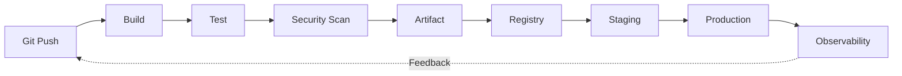

<!-- icon: pipeline -->
# CI/CD Overview

> CI/CD is the automated path from a developer's commit to verified, deployable software — Continuous Integration proves every change works, Continuous Delivery/Deployment ships it.

## 1. What Is It?

Building on the big-picture overview above, we now define the three disciplines that make up CI/CD.

- **Continuous Integration (CI):** developers merge small changes frequently; each merge triggers an automated build + test + scan. Broken code is caught in minutes, not weeks. CI answers: *does this change work?*
- **Continuous Delivery:** every change that passes CI is *releasable* — a human (or policy) decides when to deploy. Delivery answers: *could users have it right now?* Yes — at any time.
- **Continuous Deployment:** every change that passes CI reaches production *automatically* (no human gate). Deployment doesn't ask — it ships.

| | CI | Continuous Delivery | Continuous Deployment |
|---|---|---|---|
| Question | Does it work? | Could we ship it? | — (ships itself) |
| Trigger | Commit / merge | Validated artifact | Validated artifact |
| Human gate | No | Yes (approval) | No |
| Output | Verified code | Releasable artifact | Production deployment |

## 2. Why Does It Exist?

Small batches, fast feedback, reproducible artifacts. A 20-line bug found by CI in 4 minutes costs almost nothing; the same bug surfacing after a month-long branch merge costs days.

### What Happens Without CI/CD?

- **Long-lived branches → merge hell.** Weeks of divergent work collide at merge time; untangling conflicts takes days and reintroduces bugs.
- **"Works on my machine" releases.** No reproducible build means testing one thing and shipping another — every deploy is a gamble.
- **Manual testing → bugs reach users.** Humans skip steps under pressure; the checks that exist don't run on every change.
- **Manual deploys → release fear.** Deployments become rare, big, traumatic events (nobody deploys on Friday), so each one carries more risk.
- **No feedback loop.** The same class of bug ships again and again because nothing feeds production lessons back into verification.

With CI/CD, integration pain is paid in minutes per commit instead of weeks per release.

## 3. Where Does It Fit?

Now that you understand why CI/CD exists, the next question is where it fits — see how [Git, Branching & Pull Requests](../01-source-control/git-branching-pull-requests.md) triggers this automation.

The full lifecycle this knowledge base follows:



## 4. Core Concepts

Building on the lifecycle diagram, we now break down each core concept that makes this loop possible.

- **Pipeline:** the automated workflow (stages → jobs → steps, run by runners).
- **Artifact:** the versioned output (Docker image, jar) that moves unchanged between environments.
- **Environment:** staging vs production — same artifact, different config.
- **Feedback:** test results, metrics, alerts flowing back to the developer.

## 5. Realistic Example

Now that you understand the core building blocks, the next question is what a realistic end-to-end run looks like — which is exactly what the example below demonstrates.

```text
Developer pushes feature/login → PR opened
  → CI pipeline: build + unit tests + secret scan (4 min)
  → image app:sha-9f3a pushed to registry
  → deployed to staging, smoke tests pass
  → approval → same image promoted to production
  → error-rate dashboard spikes → alert → developer fixes forward
```

## 6. Common Misconceptions

Building on the example, the next question is what common misunderstandings trip up teams — addressed below.

- "CI = just running tests." CI is merge discipline *plus* automation.
- "CD always means auto-deploy to prod." Only Continuous *Deployment* does; Delivery keeps a gate.
- "Same artifact" is optional. It is not — rebuilding per environment destroys reproducibility.

## 7. Interview / Exam Notes

Building on the misconceptions, the next step is testing your knowledge — provided below.

- Define CI vs Delivery vs Deployment in one sentence each.
- Draw the commit → production graph from memory.
- Explain why the artifact must be immutable between staging and production.

## Related Topics

Building on the knowledge check, the final step is knowing where to go next — start with [Git, Branching & Pull Requests](../01-source-control/git-branching-pull-requests.md), where the lifecycle's first trigger lives.

- [Git, Branching & Pull Requests](../01-source-control/git-branching-pull-requests.md)
- [CI/CD Pipelines](../06-ci-cd-pipelines/pipelines.md)
- [Artifact Management](../05-artifacts-and-packaging/artifact-management.md)
- [Continuous Delivery](../07-continuous-delivery/continuous-delivery.md)
- [Observability & Feedback](../13-observability-and-feedback/observability-feedback.md)
