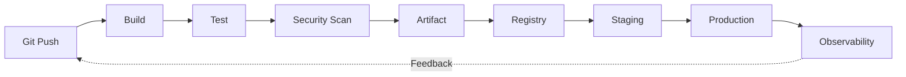
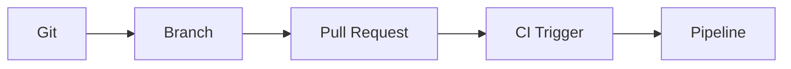

# Start Here Merged

> Merged handbook. Sources: 00-foundations/cicd-overview.md, 01-source-control/git-branching-pull-requests.md, 02-continuous-integration/continuous-integration.md.


---

<!-- merged-part-1-from: 00-foundations/cicd-overview.md -->

<!-- icon: pipeline -->
## Part 1: CI/CD Overview

> CI/CD is the automated path from a developer's commit to verified, deployable software — Continuous Integration proves every change works, Continuous Delivery/Deployment ships it.

## 1. What Is It?

Building on the big-picture overview above, we now define the three disciplines that make up CI/CD.

- **Continuous Integration (CI):** developers merge small changes frequently; each merge triggers an automated build + test + scan. Broken code is caught in minutes, not weeks. CI answers: *does this change work?*
- **Continuous Delivery:** every change that passes CI is *releasable* — a human (or policy) decides when to deploy. Delivery answers: *could users have it right now?* Yes — at any time.
- **Continuous Deployment:** every change that passes CI reaches production *automatically* (no human gate). Deployment doesn't ask — it ships.

| | CI | Continuous Delivery | Continuous Deployment |
|---|---|---|---|
| Question | Does it work? | Could we ship it? | — (ships itself) |
| Trigger | Commit / merge | Validated artifact | Validated artifact |
| Human gate | No | Yes (approval) | No |
| Output | Verified code | Releasable artifact | Production deployment |

## 2. Why Does It Exist?

Small batches, fast feedback, reproducible artifacts. A 20-line bug found by CI in 4 minutes costs almost nothing; the same bug surfacing after a month-long branch merge costs days.

### What Happens Without CI/CD?

- **Long-lived branches → merge hell.** Weeks of divergent work collide at merge time; untangling conflicts takes days and reintroduces bugs.
- **"Works on my machine" releases.** No reproducible build means testing one thing and shipping another — every deploy is a gamble.
- **Manual testing → bugs reach users.** Humans skip steps under pressure; the checks that exist don't run on every change.
- **Manual deploys → release fear.** Deployments become rare, big, traumatic events (nobody deploys on Friday), so each one carries more risk.
- **No feedback loop.** The same class of bug ships again and again because nothing feeds production lessons back into verification.

With CI/CD, integration pain is paid in minutes per commit instead of weeks per release.

## 3. Where Does It Fit?

Now that you understand why CI/CD exists, the next question is where it fits — see how [Git, Branching & Pull Requests](../01-source-control/git-branching-pull-requests.md) triggers this automation.

The full lifecycle this knowledge base follows:



## 4. Core Concepts

Building on the lifecycle diagram, we now break down each core concept that makes this loop possible.

- **Pipeline:** the automated workflow (stages → jobs → steps, run by runners).
- **Artifact:** the versioned output (Docker image, jar) that moves unchanged between environments.
- **Environment:** staging vs production — same artifact, different config.
- **Feedback:** test results, metrics, alerts flowing back to the developer.

## 5. Realistic Example

Now that you understand the core building blocks, the next question is what a realistic end-to-end run looks like — which is exactly what the example below demonstrates.

```text
Developer pushes feature/login → PR opened
  → CI pipeline: build + unit tests + secret scan (4 min)
  → image app:sha-9f3a pushed to registry
  → deployed to staging, smoke tests pass
  → approval → same image promoted to production
  → error-rate dashboard spikes → alert → developer fixes forward
```

## 6. Common Misconceptions

Building on the example, the next question is what common misunderstandings trip up teams — addressed below.

- "CI = just running tests." CI is merge discipline *plus* automation.
- "CD always means auto-deploy to prod." Only Continuous *Deployment* does; Delivery keeps a gate.
- "Same artifact" is optional. It is not — rebuilding per environment destroys reproducibility.

## 7. Interview / Exam Notes

Building on the misconceptions, the next step is testing your knowledge — provided below.

- Define CI vs Delivery vs Deployment in one sentence each.
- Draw the commit → production graph from memory.
- Explain why the artifact must be immutable between staging and production.

## Related Topics

Building on the knowledge check, the final step is knowing where to go next — start with [Git, Branching & Pull Requests](../01-source-control/git-branching-pull-requests.md), where the lifecycle's first trigger lives.

- [Git, Branching & Pull Requests](../01-source-control/git-branching-pull-requests.md)
- [CI/CD Pipelines](../06-ci-cd-pipelines/pipelines.md)
- [Artifact Management](../05-artifacts-and-packaging/artifact-management.md)
- [Continuous Delivery](../07-continuous-delivery/continuous-delivery.md)
- [Observability & Feedback](../13-observability-and-feedback/observability-feedback.md)


---

<!-- merged-part-2-from: 01-source-control/git-branching-pull-requests.md -->

<!-- icon: git -->
## Part 2: Git, Branching & Pull Requests

> Git records every change; branching isolates work; the Pull Request (PR) is the review + automated-check gate that triggers CI.

## 1. What Is It?

Picking up from **[CI/CD Overview](../00-foundations/cicd-overview.md)**, where we saw the CI/CD lifecycle triggered by a Git push, we now examine how Git, branching, and Pull Requests create the quality gate that feeds CI.

- **Git:** distributed version control — every commit is a snapshot with author, message, parent.
- **Branching:** an independent line of work (`feature/login`, `hotfix/crash`) forked from `main`.
- **Pull Request:** a proposal to merge a branch, combining human review with automated status checks.
- **CI Trigger:** the event that starts a pipeline — PR opened/updated, push to `main`, schedule, or manual.

## 2. Why Does It Exist?

Now that you understand the components, the next question is why this workflow exists — answered below.

Direct pushes to `main` bypass review and verification. The branch → PR → CI → merge flow makes every change Reviewed, Tested, and Traceable before it can break the pipeline.

## 3. Where Does It Fit?

Now that you understand why the workflow exists, the next question is where it fits in the bigger CI/CD picture — mapped below.



| Role | Detail |
|------|--------|
| WHAT | Versioned change proposal |
| PRODUCER | Developer |
| CONSUMER | CI pipeline, reviewers |
| PRODUCES | Merge commit + trigger event |
| FAILS AS | Merge conflicts, red checks, stale branches |

<!-- icon: webhook -->
## 4. How It Works

Now that you see where Git fits, the next question is how the branch → PR → CI → merge flow executes step by step — detailed below.

1. Branch from `main`, commit small logical units.
2. Push branch, open PR — CI trigger fires (`pull_request`, `push`).
3. Runner executes build/test/scan; results post back as PR checks.
4. Reviewer approves; branch merges only when checks are green (branch protection).
5. Merge to `main` fires the post-merge pipeline (artifact build).

## 5. Commands / Configuration

Now that you've seen the step-by-step flow, the next question is how to express these operations as Git commands — listed below.

```bash
git checkout -b feature/login
git add -A && git commit -m "feat(auth): add login form validation"
git push -u origin feature/login
```

```yaml
## Part 2: GitHub Actions trigger: run CI on every PR + every push to main
on:
  pull_request:
  push:
    branches: [main]
```

```yaml
## Part 2: GitLab equivalent
workflow:
  rules:
    - if: $CI_PIPELINE_SOURCE == "merge_request_event"
    - if: $CI_COMMIT_BRANCH == "main"
```

## 6. Branching Models

Now that you've seen the trigger configs, the next question is what branching strategy fits your team — compared below.

| Model | Rule | Best for |
|-------|------|----------|
| GitHub Flow | Branch → PR → main → deploy | CD teams, this KB's default |
| Git Flow | `develop` + `release/*` + `hotfix/*` | Versioned releases |
| Trunk-Based | Tiny branches, merge daily | High-velocity CI |

## 7. Failure Modes

Now that you understand the branching strategies, the next question is what can go wrong and how to fix it — covered below. This workflow continues in **[CI/CD Pipelines](../06-ci-cd-pipelines/pipelines.md)**, where the triggered pipeline executes.

- Long-lived branches → painful conflicts; fix with trunk-based discipline.
- Red checks ignored / merged with `--no-verify`; fix with required status checks.
- Merge queue races on busy `main`; fix with merge queues, linear history.

## 8. Best Practices

Building on the failure modes above, we now lock in the practices that prevent them.

- One logical change per PR; keep PRs reviewable (< ~400 lines).
- Require green CI + 1 approval before merge (branch protection).
- Conventional commits (`feat:`, `fix:`) so releases and changelogs automate.

## 9. Common Misconceptions

- "PR review replaces CI." No — humans judge design, machines verify correctness.
- "Merging equals deploying." Merging makes a change *candidate*; CD decides deployment.

## 10. Interview / Exam Notes

- Explain the PR as a quality gate: review + checks + merge policy.
- Map trigger types: push, PR, schedule, manual, tag.
- Trunk-based vs Git Flow trade-offs.

This workflow continues in **[CI/CD Pipelines](../06-ci-cd-pipelines/pipelines.md)**, where you will see the triggered pipeline execute build, test, and scan.

## Related Topics

- [CI/CD Overview](../00-foundations/cicd-overview.md)
- [CI/CD Pipelines](../06-ci-cd-pipelines/pipelines.md)


---

<!-- merged-part-3-from: 02-continuous-integration/continuous-integration.md -->

<!-- icon: pipeline -->
## Part 3: Continuous Integration

> Continuous Integration is the team discipline of merging small changes frequently with automated verification — the practice behind the pipeline, not the pipeline itself.

## 1. What Is It?

Picking up from **[Git, Branching & Pull Requests](../01-source-control/git-branching-pull-requests.md)**, where the PR gate was built — CI is the discipline that makes the gate meaningful: integrate daily, verify automatically, fix immediately.

- **Integrate:** merge to shared `main` at least daily; branches live hours-to-days, never weeks.
- **Verify:** every merge runs build + test + scan (see [CI/CD Pipelines](../06-ci-cd-pipelines/pipelines.md) for the machinery).
- **Fix:** a red `main` is the team's top priority — stop the line, revert or fix forward, then resume.

## 2. Why Does It Exist?

Integration pain grows with branch age: two-day branches merge in minutes, two-month branches merge in weeks. CI converts one terrifying merge into dozens of trivial ones.

## 3. PR Gates & Merge Queues

- **PR gate:** required status checks (green CI + approvals) enforced by branch protection. No green, no merge — no exceptions, no admin overrides "just this once."
- **Merge queue:** on busy `main`, merges serialize through a queue that rebases each PR onto the latest green `main` and re-verifies before landing. Prevents the "green on branch, red on main" race.
- **Linear history** (rebase/squash merges) keeps `main` bisectable: any commit builds, any commit reverts cleanly.
- **Preflight builds:** validate the diff on CI infrastructure *before* it lands on `main` — prevention beats fast reverts on busy branches.

## 4. Trunk Discipline

- Tiny branches, daily merges; feature flags hide unfinished work instead of long branches.
- `main` is always releasable — a broken `main` blocks everyone, so whoever breaks it fixes it first.
- Measure: merge frequency per developer per week. Falling numbers mean branches are growing teeth.
- **Build master (large teams):** a rotating shepherd who tends the pipeline and reverts lingering breakage — a temporary discipline role, not a title.
- **Ratcheting gates:** fail the build when warnings, duplication, or style violations *increase* versus the last green commit — quality can only move one direction without a big-bang cleanup.

## 5. Failure Modes

- Long-lived branches → merge hell; fix with WIP limits and flags hiding unfinished work.
- Red `main` normalized ("someone else will fix it") → quality collapse; fix with stop-the-line culture.
- Flaky gates → developers bypass checks; fix by quarantining flakes, never by disabling gates.

## 6. Interview Notes

- CI practice vs CI pipeline: discipline vs machinery.
- Why merge queues exist (the rebase race on busy `main`).
- Trunk-based vs Git Flow, and what each demands of the team.

## Related Topics

- [Git, Branching & Pull Requests](../01-source-control/git-branching-pull-requests.md)
- [CI/CD Pipelines](../06-ci-cd-pipelines/pipelines.md)
- [Testing Strategy](../04-testing/testing-strategy.md)

Small merges, verified automatically, fixed immediately — that discipline feeds every pipeline downstream. Continue in **[CI/CD Pipelines](../06-ci-cd-pipelines/pipelines.md)**.
