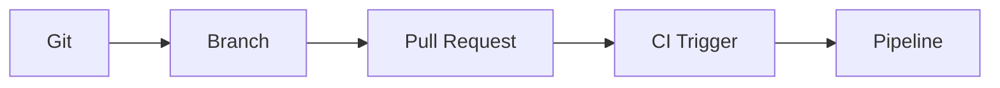

<!-- icon: git -->
# Git, Branching & Pull Requests

> Git records every change; branching isolates work; the Pull Request (PR) is the review + automated-check gate that triggers CI.

## 1. What Is It?

Picking up from **[CI/CD Overview](../00-foundations/cicd-overview.md)**, where we saw the CI/CD lifecycle triggered by a Git push, we now examine how Git, branching, and Pull Requests create the quality gate that feeds CI.

- **Git:** distributed version control — every commit is a snapshot with author, message, parent.
- **Branching:** an independent line of work (`feature/login`, `hotfix/crash`) forked from `main`.
- **Pull Request:** a proposal to merge a branch, combining human review with automated status checks.
- **CI Trigger:** the event that starts a pipeline — PR opened/updated, push to `main`, schedule, or manual.

## 2. Why Does It Exist?

Now that you understand the components, the next question is why this workflow exists — answered below.

Direct pushes to `main` bypass review and verification. The branch → PR → CI → merge flow makes every change Reviewed, Tested, and Traceable before it can break the pipeline.

## 3. Where Does It Fit?

Now that you understand why the workflow exists, the next question is where it fits in the bigger CI/CD picture — mapped below.



| Role | Detail |
|------|--------|
| WHAT | Versioned change proposal |
| PRODUCER | Developer |
| CONSUMER | CI pipeline, reviewers |
| PRODUCES | Merge commit + trigger event |
| FAILS AS | Merge conflicts, red checks, stale branches |

<!-- icon: webhook -->
## 4. How It Works

Now that you see where Git fits, the next question is how the branch → PR → CI → merge flow executes step by step — detailed below.

1. Branch from `main`, commit small logical units.
2. Push branch, open PR — CI trigger fires (`pull_request`, `push`).
3. Runner executes build/test/scan; results post back as PR checks.
4. Reviewer approves; branch merges only when checks are green (branch protection).
5. Merge to `main` fires the post-merge pipeline (artifact build).

## 5. Commands / Configuration

Now that you've seen the step-by-step flow, the next question is how to express these operations as Git commands — listed below.

```bash
git checkout -b feature/login
git add -A && git commit -m "feat(auth): add login form validation"
git push -u origin feature/login
```

```yaml
# GitHub Actions trigger: run CI on every PR + every push to main
on:
  pull_request:
  push:
    branches: [main]
```

```yaml
# GitLab equivalent
workflow:
  rules:
    - if: $CI_PIPELINE_SOURCE == "merge_request_event"
    - if: $CI_COMMIT_BRANCH == "main"
```

## 6. Branching Models

Now that you've seen the trigger configs, the next question is what branching strategy fits your team — compared below.

| Model | Rule | Best for |
|-------|------|----------|
| GitHub Flow | Branch → PR → main → deploy | CD teams, this KB's default |
| Git Flow | `develop` + `release/*` + `hotfix/*` | Versioned releases |
| Trunk-Based | Tiny branches, merge daily | High-velocity CI |

## 7. Failure Modes

Now that you understand the branching strategies, the next question is what can go wrong and how to fix it — covered below. This workflow continues in **[CI/CD Pipelines](../06-ci-cd-pipelines/pipelines.md)**, where the triggered pipeline executes.

- Long-lived branches → painful conflicts; fix with trunk-based discipline.
- Red checks ignored / merged with `--no-verify`; fix with required status checks.
- Merge queue races on busy `main`; fix with merge queues, linear history.

## 8. Best Practices

Building on the failure modes above, we now lock in the practices that prevent them.

- One logical change per PR; keep PRs reviewable (< ~400 lines).
- Require green CI + 1 approval before merge (branch protection).
- Conventional commits (`feat:`, `fix:`) so releases and changelogs automate.

## 9. Common Misconceptions

- "PR review replaces CI." No — humans judge design, machines verify correctness.
- "Merging equals deploying." Merging makes a change *candidate*; CD decides deployment.

## 10. Interview / Exam Notes

- Explain the PR as a quality gate: review + checks + merge policy.
- Map trigger types: push, PR, schedule, manual, tag.
- Trunk-based vs Git Flow trade-offs.

This workflow continues in **[CI/CD Pipelines](../06-ci-cd-pipelines/pipelines.md)**, where you will see the triggered pipeline execute build, test, and scan.

## Related Topics

- [CI/CD Overview](../00-foundations/cicd-overview.md)
- [CI/CD Pipelines](../06-ci-cd-pipelines/pipelines.md)
