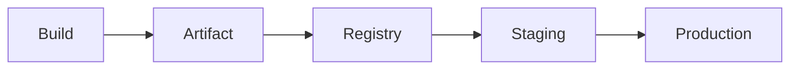

<!-- icon: artifact -->
# Artifact Management

> An artifact is the versioned, immutable output of a build (Docker image, jar, zip). The registry stores it; promotion moves the *same* artifact toward production.

## 1. What Is It?

Picking up from **[CI/CD Pipelines](../06-ci-cd-pipelines/pipelines.md)**, where the build succeeds — we now follow the one thing that outlives the pipeline: the artifact.

| Term | Meaning |
|------|---------|
| Artifact | Built output + version (e.g. `app:1.4.2`, `app:sha-9f3a`) |
| Registry | Storage + distribution (Docker Hub, GHCR, ECR, Nexus, Artifactory) |
| Promotion | Same artifact approved from staging → production (never rebuild) |

## 2. Why Does It Exist?

Rebuilding per environment means testing one binary and shipping another. Immutable artifacts guarantee **what passed staging is what runs in production**.

## 3. Where Does It Fit?



| Role | Detail |
|------|--------|
| PRODUCER | Build job in CI pipeline |
| CONSUMER | CD pipeline / deployment |
| STORAGE | Artifact registry |
| LIFECYCLE | Build → Store → Promote → Deploy → Retire |

## 4. How It Works

1. CI builds once: `docker build -t registry/app:sha-9f3a .`
2. Push with immutable tag (commit SHA) + moving tag (`main-latest`).
3. Staging deploys `sha-9f3a`; smoke tests pass.
4. Promotion tags/approves the *same digest* (content hash — the image's fingerprint) for production (`1.4.2`).
5. Retention policy prunes old untagged images.

## 5. Commands / Configuration

```bash
docker build -t ghcr.io/acme/app:sha-9f3a .
docker push ghcr.io/acme/app:sha-9f3a
docker tag ghcr.io/acme/app:sha-9f3a ghcr.io/acme/app:1.4.2
docker push ghcr.io/acme/app:1.4.2
```

## 6. Versioning

- Immutable primary tag: commit SHA (`sha-9f3a`) — traceable, never overwritten.
- Human tags: semver (semantic versioning, `MAJOR.MINOR.PATCH`, e.g. `1.4.2`) applied at promotion, never rebuilt.
- Never deploy `:latest` to production — it is unrepeatable.

### Versioning Schemes

| Scheme | Example | Best for |
|--------|---------|----------|
| Commit SHA | `app:sha-9f3a2c1` | Primary immutable tag — every build traceable to code |
| Semver | `1.4.2` | Human releases, changelogs, compatibility promises |
| Build numbers | `app:build-1042` | Sequential CI runs (Jenkins `BUILD_NUMBER`); simple ordering, no code link |
| Date-based | `2026.09.09-3` | Nightly/scheduled builds where recency matters |

Combine: SHA always (truth), plus one human scheme at promotion (meaning). Never invent a fourth scheme per team — one registry, one convention.

## 7. Failure Modes

- Mutable tags overwritten → unreproducible deploys; fix with SHA digests + tag immutability.
- Registry bloat/slow pulls; fix with retention + layer caching + regional mirrors.
- Secrets baked into images; fix with multi-stage builds + secret mounts, scan with Trivy.

## 8. Best Practices

- One build, promote the digest everywhere.
- Sign artifacts (cosign attaches a cryptographic signature proving who built the image) and keep SBOMs (Software Bill of Materials: the machine-readable ingredient list of every package inside) so a future CVE can be traced to exactly the affected images.
- Separate registries/repos per stage only as policy requires; prefer one registry + promotion labels.

### Signing, SBOM & Provenance

- **Sign** at build time (cosign): signature travels with the digest; deploy policies (`admission controllers`) reject unsigned images.
- **SBOM** (Software Bill of Materials) generated per build (Syft/Trivy) and stored beside the artifact — when CVE-20XX lands, query which digests contain the package instead of rebuilding the world.
- **Provenance** (SLSA-style attestation): who built it, from which commit, with which pipeline. Consumers verify provenance before promoting — trust the builder, not just the bits.

## 9. Interview / Exam Notes

- Why the same artifact must flow through all environments.
- SHA vs semver vs latest tagging strategy.
- Push vs pull deployment models for artifacts.

The artifact is frozen — now it must travel. Continue in **[Continuous Delivery](../07-continuous-delivery/continuous-delivery.md)**, where this exact digest moves through staging to production.

## Related Topics

- [CI/CD Pipelines](../06-ci-cd-pipelines/pipelines.md)
- [Continuous Delivery](../07-continuous-delivery/continuous-delivery.md)
