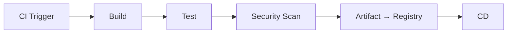

<!-- icon: pipeline -->
# CI/CD Pipelines

> A pipeline is the automated workflow from trigger to deployment — stages (phases) contain jobs (units of work) contain steps (operations), executed by runners.

## 1. What Is It?

Picking up from **[Git, Branching & Pull Requests](../01-source-control/git-branching-pull-requests.md)**, where a merge fires the trigger — we now examine the pipeline that the trigger starts.

| Term | Meaning | Example |
|------|---------|---------|
| Pipeline | Whole automated workflow | `.github/workflows/ci.yml` |
| Stage | Logical phase | build → test → scan |
| Job | Unit of work (often parallel) | `unit-tests`, `docker-build` |
| Step | Single operation in a job | `npm ci`, `npm test` |
| Runner / Agent | Machine executing jobs | GitHub-hosted `ubuntu-latest`, self-hosted agent |

## 2. Why Does It Exist?

Manual build → test → scan → package is slow and inconsistent. A pipeline makes verification **automatic, repeatable, and fast** on every change.

## 3. Where Does It Fit?



## 4. How It Works

1. Trigger fires (PR, push, schedule).
2. Runner checks out code, sets up toolchain (with dependency cache).
3. **Build** compiles/bundles; **Test** runs unit/integration suites; **Security Scan** checks deps/secrets/config.
4. Fail-fast or continue-on-error per policy; results + logs return as feedback.
5. On success of all required jobs, the artifact job packages and pushes.

## 5. Example (GitHub Actions)

```yaml
name: ci
on:
  pull_request:
  push:
    branches: [main]

jobs:
  build:
    runs-on: ubuntu-latest
    steps:
      - uses: actions/checkout@v4
      - uses: actions/setup-node@v4
        with: { node-version: 20, cache: npm }
      - run: npm ci
      - run: npm run build

  test:
    needs: build
    runs-on: ubuntu-latest
    steps:
      - uses: actions/checkout@v4
      - uses: actions/setup-node@v4
        with: { node-version: 20, cache: npm }
      - run: npm ci
      - run: npm test -- --coverage

  scan:
    needs: build
    runs-on: ubuntu-latest
    steps:
      - uses: actions/checkout@v4
      - run: npm audit --audit-level=high
      # - uses: gitleaks/gitleaks-action@v2  # secret scan
```

<!-- icon: build -->
<!-- icon: testing -->
<!-- icon: security -->
## 6. The Three Verification Stages

- **Build:** `npm ci → npm run build`, `docker build`. Must be hermetic — sealed from the ambient machine: pinned dependencies, clean environment, no hidden host tools — so the same commit builds byte-identically anywhere. Failure = code doesn't compile/bundle.
- **Test:** unit (fast, per-PR) → integration (services) → E2E/smoke (staging). Keep PR suites < 10 min; move slow suites to post-merge.
- **Security Scan:** dependency audit (`npm audit`), secret scan (gitleaks), SAST/image scan (Trivy). Run on every PR — shifting left is cheaper than incident response.

Now that you understand what can fail, the next question is where successful builds go — which is exactly what **[Artifact Management](../05-artifacts-and-packaging/artifact-management.md)** covers: the versioned output that survives the pipeline.

<!-- icon: docker -->
### Building Images Without a Docker Daemon: BuildKit & Kaniko

Socket mounts and DinD both hand builds daemon power. Two tools shrink or remove that privilege:

**BuildKit** (the modern `docker build` engine):

- **WHAT:** the builder behind `docker buildx` — parallel stage execution, content-addressed caching, secret/SSH/cache mounts.
- **WHY:** classic builds re-download dependencies every run and leak secrets into layers; BuildKit makes builds fast (shared cache) and safe (mounts never persist).
- **HOW:** point the CLI at a builder (local daemon or remote `BUILDKIT_HOST`), declare mounts in the Dockerfile, push with registry cache refs.

```bash
# BuildKit via buildx: parallel stages, layer + inline caching, secret mounts
docker buildx build --push \
  --cache-to type=registry,ref=registry/app:cache \
  --cache-from type=registry,ref=registry/app:cache \
  --secret id=REG_PWD,env=REG_PWD \
  -t registry/app:$GIT_COMMIT .
```

```dockerfile
# Cache mounts: dependencies survive rebuilds without bloating layers
RUN --mount=type=cache,target=/root/.npm npm ci
RUN --mount=type=secret,id=REG_PWD npm publish
```

**Kaniko** (daemonless, for Kubernetes agents that forbid sockets and privileged mode):

- **WHAT:** a container image (`gcr.io/kaniko/executor`) that builds Docker images from a Dockerfile entirely in userspace — no daemon, no privileged flag.
- **WHY:** hardened clusters ban socket mounts (host root) and DinD (privileged); Kaniko is the only compliant way to build images there.
- **HOW:** run the executor container with the build context mounted, pass `--destination` for the registry target; it snapshots each Dockerfile instruction into layers itself. (Jenkins calling convention: see [Jenkins Pipelines](../15-platforms-and-tools/jenkins/jenkins-pipelines.md#kaniko-on-kubernetes-agents).)

| | BuildKit (`buildx`) | Kaniko |
|---|---|---|
| Needs daemon | Yes (local or remote `BUILDKIT_HOST`) | No — unprivileged userspace build |
| Best in | Jenkins Docker agents, dev machines, GHA runners | Locked-down K8s (no socket, no `--privileged`) |
| Caching | Registry + local + GitHub Actions cache backends | Registry cache (`--cache=true --cache-repo=...`) |
| Secrets | `--secret` mounts (never in layers) | Build args only — prefer short-lived tokens |

Rule: default to BuildKit everywhere a daemon exists; reach for Kaniko exactly where daemons are banned (hardened clusters, shared multitenant agents).

## 7. Execution: Dependencies & Parallelism

- `needs: build` = sequential gate; independent jobs (`test`, `scan`) run in parallel.
- Fail-fast default; use `continue-on-error` only for advisory (non-blocking) checks.
- Cache dependencies (`cache: npm`, Docker layer cache) — biggest free speedup.

### Runners Deep Dive

| | Managed (GitHub-hosted, Jenkins Docker cloud) | Self-hosted (VM, bare metal, ARC) |
|---|---|---|
| You manage | Nothing — fresh env per job | OS, patches, scaling, idle cost |
| Best for | Standard builds, burst capacity | GPUs, private nets, licenses, exotic OS |
| Caches | Cold each run (use registry/remote cache) | Warm local cache (fast, but drift risk) |

Cache layers, fastest first: dependency cache (`~/.npm`, `~/.m2`) → build-tool remote cache (BuildKit registry cache, Gradle remote) → artifact reuse (skip rebuild when inputs unchanged). Cache key must include lockfiles; stale keys cause "works in CI, fails locally" in reverse.

### Parallelism, Dependencies & Failure Handling

- **DAG, not sequence:** express `needs:` truthfully; independent jobs fan out, gates fan in. A linear pipeline is usually an unoptimized one.
- **Matrices** multiply one definition across versions/OSes — cap axes (3×3=9 jobs burns quota and attention).
- **Fail-fast** (default) stops the run at first red; use for PR signal. **Advisory** (`continue-on-error`) for experimental checks that must not block merges.
- **Retry** only idempotent steps (network fetches), never deployments. **Quarantine** flaky tests to a non-blocking suite with an owner and a deadline — a flaky gate trains developers to ignore red.

## 8. Failure Modes & Troubleshooting

| Symptom | Likely cause | Fix |
|---------|--------------|-----|
| Flaky tests | Shared state, time deps | Quarantine, fix or delete flaky test |
| Slow pipeline | No cache, huge matrices | Cache, split jobs, parallelize |
| "Works locally" | Unpinned deps, dirty env | Lockfiles, containerized runners |
| Red main | Post-merge suite not required | Require it; revert-or-fix-forward policy |

## 9. Best Practices

- Fast PR pipeline (< 10 min), thorough post-merge pipeline.
- Pin action/tool versions (`@v4`, exact image tags).
- Never bake secrets into logs/images; use masked CI secrets.
- Same steps locally and in CI (`npm ci && npm test`) to kill env drift.

## 10. Common Misconceptions

- "More stages = more safety." Each stage must earn its minutes; slow pipelines get bypassed.
- "Green pipeline = correct software." It means *checked* software — coverage gaps still ship bugs.

## 11. Real-World Scenario

Team's PR suite takes 35 min → developers stack PRs without waiting → `main` breaks weekly. Fix: cache deps, parallelize test/scan, move E2E to staging; PR time drops to 7 min, `main` stays green.

## 12. Interview / Exam Notes

- Define pipeline → stage → job → step → runner precisely.
- Explain fail-fast vs advisory checks, sequential vs parallel jobs.
- What belongs in PR pipeline vs post-merge vs staging gates.

This pipeline produces one thing that outlives it — the artifact. Continue in **[Artifact Management](../05-artifacts-and-packaging/artifact-management.md)**.

## Related Topics

- [Git, Branching & Pull Requests](../01-source-control/git-branching-pull-requests.md)
- [Artifact Management](../05-artifacts-and-packaging/artifact-management.md)
- [Continuous Delivery](../07-continuous-delivery/continuous-delivery.md)
