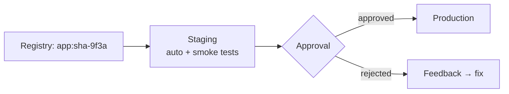

<!-- icon: deployment -->
# Continuous Delivery

> Continuous Delivery: every change that passes CI is *releasable* — deployment to staging is automatic, to production is a decision (approval). Continuous Deployment removes even that gate.

## 1. What Is It?

Picking up from **[Artifact Management](../05-artifacts-and-packaging/artifact-management.md)**, where the digest was frozen — we now move that exact artifact through staging to production.

- **Continuous Delivery:** pipeline auto-deploys to staging; production needs an approval/policy gate.
- **Continuous Deployment:** pipeline auto-deploys to production too.
- **Environment:** a runtime context — staging (prod-like rehearsal) vs production (real users).
- **Release:** a version made available; **Deployment:** installing it somewhere; **Promotion:** approving the same artifact for the next environment.

### Delivery vs Deployment

One gate of difference:

| | Continuous Delivery | Continuous Deployment |
|---|---|---|
| After CI passes | Releasable, auto-staged | Shipped to production |
| Production deploy | A human/policy decision | Automatic |
| Motto | "We *could* ship anytime" | "We *do* ship every time" |
| Risk control | Approval gate | Progressive delivery + fast rollback |

## 2. Why Does It Exist?

Merging is not shipping. Delivery closes the gap: staging proves the artifact in prod-like conditions, approvals control risk, and releases become routine instead of events.

## 3. Where Does It Fit?



## 4. How It Works

1. Post-merge pipeline pushes artifact; CD auto-deploys its digest to staging.
2. Automated smoke tests + (optional) manual QA run in staging.
3. Approval gate: human click, or policy gate that auto-approves when all checks are green, the deploy lands inside the allowed time window (change window — e.g. business hours, never Friday night), and the code owner has signed off.
4. CD deploys the *same digest* to production using per-environment config (env vars, secrets, scaling).
5. Post-deploy verification (health checks, error budget — the allowable failure quota; if it burns too fast, releases halt) confirms success.

## 5. Example

Helm (the package manager for Kubernetes) installs the chart with the tested image tag — same digest, environment-specific values:

```yaml
# Conceptual CD flow (platform syntax varies)
deploy-staging:
  environment: staging      # auto on main
  script: helm upgrade app ./chart --set image.tag=$SHA

deploy-production:
  environment: production   # manual approval gate
  needs: [deploy-staging, smoke-tests]
  when: manual
  script: helm upgrade app ./chart --set image.tag=$SHA
```

## 6. Staging vs Production

| | Staging | Production |
|---|---|---|
| Purpose | Rehearse, catch env issues | Serve users |
| Data | Sanitized/anonymized | Real |
| Deploys | Automatic | Gated |
| Scale | Smaller but representative | Full |

## 7. Failure Modes

- Config drift (staging ≠ prod) → env-specific bugs; fix with same chart/manifests, env-only values.
- Approval bottleneck (every typo needs a manager); fix with policy gates for low-risk paths.
- Deploying a rebuild instead of the tested digest; fix by pinning digests end-to-end.

## 8. Best Practices

- Same artifact digest from staging to production, always.
- Separate config from code (env vars/secrets per environment).
- Small batches + feature flags (toggles switching code paths at runtime without redeploying) so approvals stay fast and safe.
- Every production deploy must be observable and reversible (see next doc).

## 9. Common Misconceptions

- "Delivery = Deployment." Delivery keeps the decision; Deployment automates it.
- "Staging guarantees prod success." It reduces risk; traffic, data, and scale still differ — hence [deployment strategies](../10-deployment-strategies/deployment-strategies.md) (canary, blue-green).

## 10. Interview / Exam Notes

- Delivery vs Deployment in one sentence each.
- Design an approval gate: who/what approves, on what signal.
- Why staging must mirror production's topology but never its data.

The release is live — now it must be watched. Continue in **[Observability & Feedback](../13-observability-and-feedback/observability-feedback.md)**, where production signals close the loop back to the developer.

## Related Topics

- [Artifact Management](../05-artifacts-and-packaging/artifact-management.md)
- [Observability & Feedback](../13-observability-and-feedback/observability-feedback.md)
