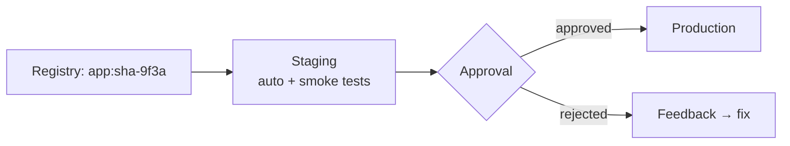

# Delivery Envs Iac

> Merged handbook. Sources: 07-continuous-delivery/continuous-delivery.md, 08-continuous-deployment/continuous-deployment.md, 09-environments-and-release/environments-release.md, 12-infrastructure-and-configuration/iac-environments.md.


---

<!-- merged-part-1-from: 07-continuous-delivery/continuous-delivery.md -->

<!-- icon: deployment -->
## Part 1: Continuous Delivery

> Continuous Delivery: every change that passes CI is *releasable* — deployment to staging is automatic, to production is a decision (approval). Continuous Deployment removes even that gate.

## 1. What Is It?

Picking up from **[Artifact Management](../05-artifacts-and-packaging/artifact-management.md)**, where the digest was frozen — we now move that exact artifact through staging to production.

- **Continuous Delivery:** pipeline auto-deploys to staging; production needs an approval/policy gate.
- **Continuous Deployment:** pipeline auto-deploys to production too.
- **Environment:** a runtime context — staging (prod-like rehearsal) vs production (real users).
- **Release:** a version made available; **Deployment:** installing it somewhere; **Promotion:** approving the same artifact for the next environment.

### Delivery vs Deployment

One gate of difference:

| | Continuous Delivery | Continuous Deployment |
|---|---|---|
| After CI passes | Releasable, auto-staged | Shipped to production |
| Production deploy | A human/policy decision | Automatic |
| Motto | "We *could* ship anytime" | "We *do* ship every time" |
| Risk control | Approval gate | Progressive delivery + fast rollback |

## 2. Why Does It Exist?

Merging is not shipping. Delivery closes the gap: staging proves the artifact in prod-like conditions, approvals control risk, and releases become routine instead of events.

## 3. Where Does It Fit?



## 4. How It Works

1. Post-merge pipeline pushes artifact; CD auto-deploys its digest to staging.
2. Automated smoke tests + (optional) manual QA run in staging.
3. Approval gate: human click, or policy gate that auto-approves when all checks are green, the deploy lands inside the allowed time window (change window — e.g. business hours, never Friday night), and the code owner has signed off.
4. CD deploys the *same digest* to production using per-environment config (env vars, secrets, scaling).
5. Post-deploy verification (health checks, error budget — the allowable failure quota; if it burns too fast, releases halt) confirms success.

## 5. Example

Helm (the package manager for Kubernetes) installs the chart with the tested image tag — same digest, environment-specific values:

```yaml
## Part 1: Conceptual CD flow (platform syntax varies)
deploy-staging:
  environment: staging      # auto on main
  script: helm upgrade app ./chart --set image.tag=$SHA

deploy-production:
  environment: production   # manual approval gate
  needs: [deploy-staging, smoke-tests]
  when: manual
  script: helm upgrade app ./chart --set image.tag=$SHA
```

## 6. Staging vs Production

| | Staging | Production |
|---|---|---|
| Purpose | Rehearse, catch env issues | Serve users |
| Data | Sanitized/anonymized | Real |
| Deploys | Automatic | Gated |
| Scale | Smaller but representative | Full |

## 7. Failure Modes

- Config drift (staging ≠ prod) → env-specific bugs; fix with same chart/manifests, env-only values.
- Approval bottleneck (every typo needs a manager); fix with policy gates for low-risk paths.
- Deploying a rebuild instead of the tested digest; fix by pinning digests end-to-end.

## 8. Best Practices

- Same artifact digest from staging to production, always.
- Separate config from code (env vars/secrets per environment).
- Small batches + feature flags (toggles switching code paths at runtime without redeploying) so approvals stay fast and safe.
- Every production deploy must be observable and reversible (see next doc).

## 9. Common Misconceptions

- "Delivery = Deployment." Delivery keeps the decision; Deployment automates it.
- "Staging guarantees prod success." It reduces risk; traffic, data, and scale still differ — hence [deployment strategies](../10-deployment-strategies/deployment-strategies.md) (canary, blue-green).

## 10. Interview / Exam Notes

- Delivery vs Deployment in one sentence each.
- Design an approval gate: who/what approves, on what signal.
- Why staging must mirror production's topology but never its data.

The release is live — now it must be watched. Continue in **[Observability & Feedback](../13-observability-and-feedback/observability-feedback.md)**, where production signals close the loop back to the developer.

## Related Topics

- [Artifact Management](../05-artifacts-and-packaging/artifact-management.md)
- [Observability & Feedback](../13-observability-and-feedback/observability-feedback.md)


---

<!-- merged-part-2-from: 08-continuous-deployment/continuous-deployment.md -->

<!-- icon: deployment -->
## Part 2: Continuous Deployment

> Continuous Deployment removes the last human gate: every change passing all automated checks reaches production by itself. Freedom bought with automation rigor most teams haven't built yet.

## 1. What Is It?

Picking up from **[Continuous Delivery](../07-continuous-delivery/continuous-delivery.md)**, where a human approved production — here the pipeline approves itself. Delivery asks "could we ship?"; Deployment ships.

## 2. Prerequisites (All Non-Negotiable)

- **Full automation:** build, test, scan, staging deploy, smoke, promotion — zero manual steps. Any human errand becomes the bottleneck that breaks the model.
- **Progressive delivery:** canary or flags on every release (see [Deployment Strategies](../10-deployment-strategies/deployment-strategies.md)) — automation needs a small blast radius to be safe.
- **Kill criteria:** automated halt conditions (error-budget burn, p99 regression, business KPI drop) that stop and roll back without asking.
- **Observability:** version-labeled everything, SLOs with burn alerts, on-call that trusts the automation (see [Observability](../13-observability-and-feedback/observability-feedback.md)).
- **Trunk discipline + flags:** unfinished work hides behind flags; branches live hours-to-days, never weeks — main is always shippable.

## 3. Failure Modes

- Automating a flaky pipeline → auto-shipping bugs at machine speed; fix gates first, automate second.
- No kill criteria → bad release reaches 100% "successfully"; every auto-promotion needs an automated halt.
- Database migrations without expand-contract → auto-deploy corrupts state; migrations must be backward-compatible across versions.
- On-call distrusts automation → humans re-add manual gates; fix with practiced, boring rollbacks that build confidence.

## 4. Delivery vs Deployment: When Each

- **Delivery** (human gate): regulated industries, data migrations, marketing-coordinated launches, teams still building gate maturity.
- **Deployment** (no gate): SaaS with progressive delivery, strong SLOs, practiced rollback, and trunk discipline. Start with low-risk services, expand the blast radius as confidence compounds.

## 5. Interview Notes

- Five prerequisites from memory, and how to verify each exists.
- Why automating a bad pipeline multiplies harm.
- Expand-contract migrations: why they're the price of auto-deploy.

## Related Topics

- [Continuous Delivery](../07-continuous-delivery/continuous-delivery.md)
- [Deployment Strategies](../10-deployment-strategies/deployment-strategies.md)
- [Observability & Feedback](../13-observability-and-feedback/observability-feedback.md)

Auto-shipping needs somewhere to land safely. Continue in **[Environments & Release](../09-environments-and-release/environments-release.md)**.


---

<!-- merged-part-3-from: 09-environments-and-release/environments-release.md -->

<!-- icon: deployment -->
## Part 3: Environments & Release

> Environments are runtime contexts with different data, scale, and risk; release is the discipline of moving one artifact across them safely — same binary, different config, explicit promotion paths.

## 1. What Is It?

Picking up from **[Continuous Deployment](../08-continuous-deployment/continuous-deployment.md)**, where automation needed safe landing zones — here is how those zones are built and governed.

## 2. Environment Topology

| Env | Purpose | Data | Deploys |
|-----|---------|------|---------|
| Dev | Individual velocity | Fake/local | Continuous, anything |
| Preview (per-PR) | Review the actual change | Sanitized snapshot | Auto per PR, destroyed on merge |
| Staging | Prod rehearsal | Sanitized/anonymized prod-like | Auto on main |
| Production | Real users | Real | Gated (delivery) or automated (deployment) |

Preview environments are the highest-leverage addition: reviewers click the change instead of imagining it.

## 3. Config vs Code

The artifact never changes between environments; everything else does via config: env vars for simple values, secret stores for credentials, config maps/files for structured settings. Inject each setting at the latest safe point — build-time injection forces per-environment artifacts and voids test-what-you-ship; deploy- or runtime injection keeps one binary everywhere. Twelve-factor discipline: a diff between staging and production behavior must be explainable by config diff alone — never by "we built it differently."

## 4. Release Trains & Promotion Paths

- **Release train:** scheduled departures (e.g. Tuesdays/Thursdays); whatever is green and approved rides, the rest waits for the next train. Predictable for stakeholders, calming for on-call.
- **Promotion path:** dev → preview → staging → production, each gate explicit (checks + approvals + signals). Skipping environments is the process smell that precedes incidents.
- **Hotfix lane:** a documented fast path (fewer approvals, same checks) for production fires — used rarely, reviewed always.
- **Release readiness checklist:** owners named, config externalized, environments IaC-built, approvals + monitors + data migration + back-out plan + support handoff. No checklist, no release.

## 5. Failure Modes

- Snowflake environments (hand-configured staging) → "works in staging" lies; environments are code (IaC), rebuilt identically.
- Real prod data in staging → breach waiting to happen; sanitize/anonymize with production-like shape.
- Config in code (URLs baked into images) → rebuild per env, voiding artifact immutability; externalize everything.

## 6. Interview Notes

- Why preview environments beat screenshots for review quality.
- Config-vs-code: what breaks when the artifact differs per env.
- Design a hotfix lane that stays safe under pressure.

## Related Topics

- [Continuous Delivery](../07-continuous-delivery/continuous-delivery.md)
- [Continuous Deployment](../08-continuous-deployment/continuous-deployment.md)
- [Deployment Strategies](../10-deployment-strategies/deployment-strategies.md)

Zones built and governed — now lock down the supply chain running through them. Continue in **[CI/CD Security](../11-security/cicd-security.md)**.


---

<!-- merged-part-4-from: 12-infrastructure-and-configuration/iac-environments.md -->

<!-- icon: terraform -->
## Part 4: IaC for Environments

> Environments are too important to be clicked into existence: Terraform (or equivalent) declares every environment's infrastructure so staging and production differ only by config — never by history.

## 1. What Is It?

Picking up from **[ArgoCD & GitOps](../15-platforms-and-tools/argocd-gitops.md)**, where app state became declarative — IaC does the same for everything underneath: VPCs, clusters, databases, DNS, IAM. Same modules, different inputs per environment.

## 2. Structure That Scales

```text
envs/
├── modules/          # vpc, cluster, db — written once
├── dev/              # small sizes, short retention
├── staging/          # prod-shaped, sanitized data
└── prod/             # real sizes, real data, approvals
```

- **State per environment** (never shared): one blast radius per state file; remote backend with locking.
- **Modules pinned by version** — floating module sources are `:latest` with extra steps.
- **Env diff = input diff:** instance sizes, counts, secrets references. A behavioral difference not explainable by inputs is a bug.

## 3. IaC in the Pipeline

- `terraform plan` on every PR touching `envs/` — the plan is the review.
- `apply` gated like any production deployment (approvals on prod, auto on dev).
- **Drift detection** on schedule: `plan` nightly, alert on unexpected diffs — the IaC equivalent of ArgoCD's self-heal.
- Jenkins controller itself can be code too (JCasC — see [Jenkins Advanced](../15-platforms-and-tools/jenkins/jenkins-advanced.md)).

## 4. Preview Environments, Automated

Combine the pieces: PR → pipeline runs a Terraform workspace (or ArgoCD ApplicationSet) → ephemeral env with sanitized data → destroy on merge. The highest-leverage environment pattern, fully automated, zero snowflakes.

## 5. Failure Modes

- Shared state across envs → dev `apply` deletes prod tables; separate states, separate credentials.
- Unreviewed `apply` on prod → treat IaC changes like code: PR, plan output, approval.
- Secrets in state files → state holds secrets in plaintext; encrypt backends, restrict access, prefer external secret stores.
- ClickOps drift → someone "fixes" prod in the console; drift alerts + periodic `apply` reconciliation.

## 6. Interview Notes

- Why state-per-environment (blast radius).
- Plan-as-review: what makes IaC changes safe to approve.
- Where JCasC fits (controller config as code, same discipline).

## Related Topics

- [Environments & Release](../09-environments-and-release/environments-release.md)
- [ArgoCD & GitOps](../15-platforms-and-tools/argocd-gitops.md)
- [Jenkins Advanced](../15-platforms-and-tools/jenkins/jenkins-advanced.md)

Infrastructure declared — the library's platform arc is complete. Return to the **[Topic Index](../TOPIC_INDEX.md)**.
