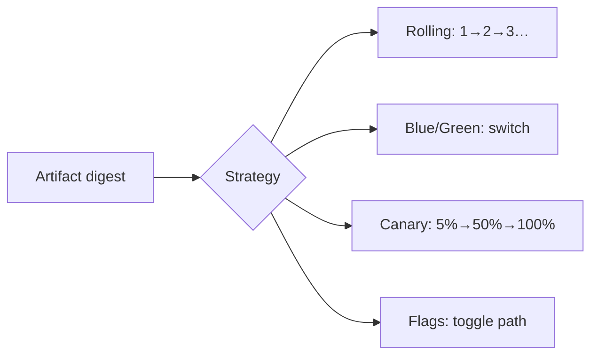

<!-- icon: deployment -->
# Deployment Strategies

> A deployment strategy answers *how a new version replaces the old one*: all at once, side by side, or slice by slice. Same artifact, different traffic shape — pick by blast radius.

## 1. What Is It?

Picking up from **[Continuous Delivery](../07-continuous-delivery/continuous-delivery.md)**, where the approval gate opened — we now choose *how* the new version meets real traffic.

| Strategy | Shape | Downtime | Rollback |
|----------|-------|----------|----------|
| Recreate | Stop all → start new | Yes | Slow (redeploy old) |
| Rolling | Replace pods/instances gradually | No | Slow (roll back gradually) |
| Blue/Green | Two full environments, switch traffic | No | Instant (switch back) |
| Canary | New version to a small subset first, expand on success | No | Fast (drain canary) |
| Feature Flags | Both versions deployed; code path toggled at runtime | No | Instant (flip flag) |

## 2. Why Does It Exist?

Deploying is the riskiest moment in CD: new code meets real traffic, data, and scale. Strategies bound the **blast radius** — how many users feel a bad release before you stop it.

## 3. Where Does It Fit?

| Role | Detail |
|------|--------|
| PRODUCER | CD pipeline (same digest as staging) |
| CONSUMER | Production traffic |
| DECIDES | Risk tolerance, traffic control, data compatibility |

## 4. How Each Works

**Recreate:** delete all old replicas, start new ones. Simplest; downtime during the gap. Use only where brief outages are acceptable (dev tools, batch jobs).

**Rolling:** replace instances one batch at a time (`maxUnavailable`, `maxSurge` in Kubernetes). No downtime, but a bad version slowly poisons the fleet — pair with health probes that halt the rollout.

**Blue/Green:** run Blue (current) and Green (new) side by side; validate Green with mirrored or smoke traffic; flip the router. Rollback = flip back. Costs double capacity during the switch.

**Canary:** route 5% of users to the new version; watch golden signals (error rate, p99); expand 5→25→50→100% or drain on alert. Needs traffic splitting (service mesh, ingress weights) and version-labeled metrics.

**Feature Flags:** ship the code dark, enable per user/cohort/percent via a flag service. Rollback without redeploying. Debt warning: stale flags rot — every flag needs an owner and an expiry date.

## 5. Choosing

- Stateless web service, low risk → **Rolling** (default).
- Can't tolerate partial fleet on a bad version → **Blue/Green**.
- Need production proof before full exposure → **Canary**.
- Need instant kill-switch or gradual user rollout → **Feature Flags**.
- Anything stateful (databases, migrations) → strategy is necessary but not sufficient: expand-contract migrations, backward-compatible schemas first.

## 6. Failure Modes

- Rolling without health probes → bad version reaches 100% "successfully"; probes must gate each batch.
- Blue/Green with shared mutable state (one database, two schemas) → Green writes data Blue can't read; keep schemas backward-compatible across the switch.
- Canary without version labels → metrics blend, signals lie; label every metric/log/trace by version.
- Flag sprawl → untestable combinations; cap active flags, delete the dead ones.
- Session affinity + canary → same users stuck on the bad slice; design for stateless or drain gracefully.

## 7. Best Practices

- Same digest everywhere; strategy changes traffic, never the binary.
- Automate promotion *and* halt conditions (error budget burn stops a canary without a human).
- Practice rollback on staging until it's boring — rollback is a feature, tested like one.
- Database migrations expand-contract: add (nullable) → migrate → enforce, never drop-then-add.

## 8. Common Misconceptions

- "Blue/Green means zero risk." It means fast rollback — Green still meets real traffic at the flip.
- "Canary is just slow Rolling." Rolling replaces capacity; canary tests a hypothesis on a subset with explicit success criteria.
- "Feature flags replace strategies." Flags control *code paths*; you still need a strategy to move traffic between versions.

## 9. Interview / Exam Notes

- Draw all five shapes from memory with rollback story each.
- When Blue/Green over Rolling? When Canary over Blue/Green?
- Why stateful data breaks naive strategy thinking (migrations first).

Strategy chosen — but canary is blind without signals. Continue in **[Observability & Feedback](../13-observability-and-feedback/observability-feedback.md)**, whose golden signals gate every progressive rollout.

## Related Topics

- [Continuous Delivery](../07-continuous-delivery/continuous-delivery.md)
- [Artifact Management](../05-artifacts-and-packaging/artifact-management.md)
- [Observability & Feedback](../13-observability-and-feedback/observability-feedback.md)
