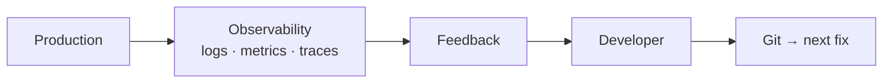

<!-- icon: monitoring -->
# Observability & Feedback

> Observability (logs, metrics, traces) reveals what a deployment actually did; feedback routes that signal back to the developer so the loop — commit → production → learning — closes.

## 1. What Is It?

Picking up from **[Continuous Delivery](../07-continuous-delivery/continuous-delivery.md)**, where the digest reached production — we now watch what it does there and feed the lessons back.

- **Observability:** logs (events), metrics (numbers over time), traces (request paths) answering "what is production doing?"
- **Feedback:** every signal returned to the author: PR check results, staging smoke verdicts, prod alerts, DORA trends (DORA = DevOps Research & Assessment; its four delivery signals are listed in §7).

## 2. Why Does It Exist?

Without feedback, deployment is a cliff — code leaves the pipeline and nobody learns. The loop `deploy → observe → learn → fix` is what makes CI/CD self-improving instead of merely automated.

## 3. Where Does It Fit?



| Signal | Consumer | Action |
|--------|----------|--------|
| PR checks | Developer | Fix before merge |
| Staging smoke | Team | Block promotion |
| Error-rate/latency alert | On-call | Roll back or forward-fix |
| Deploy frequency, MTTR (mean time to recovery) trends | Leads | Improve pipeline |

## 4. How It Works

1. Every deploy is labeled (version/SHA) so logs/metrics correlate with the change.
2. Dashboards track golden signals — the four user-visible health metrics: latency, traffic, errors, saturation — plus business KPIs.
3. Alerts fire on symptom (error budget burn — failures consuming the allowed quota too fast; p99 spike — the slowest 1% of requests degrading), not on every deploy.
4. Incident → revert or forward-fix → postmortem feeds back into pipeline gates (new test, new scan, tighter approval).

## 5. Example

```text
v1.4.2 deploys to production (SHA-labeled)
  → error rate 0.2% → 3.1% in 10 min (alert fires)
  → on-call rolls back to v1.4.1 (4 min, MTTR clock stops)
  → postmortem: missing integration test for null avatar
  → new test added to PR pipeline so the class of bug can't recur
```

## 6. Failure Modes

- Alert fatigue (noisy thresholds) → alerts ignored; fix with SLO-based alerts (SLO = Service Level Objective, e.g. 99.9% successful requests; alert when the error budget burns, not on every blip).
- Unlabeled deploys (can't tell which version broke prod); fix with version annotations everywhere.
- Postmortems without pipeline changes → repeat incidents; every action item should land as a test, check, or runbook.

### SLI / SLO / Alerting

- **SLI** (indicator): what you measure — success ratio, p99 latency. **SLO** (objective): the promise — 99.9% success over 30 days. **Error budget**: 100% − SLO; the failures you're allowed.
- Alert on **budget burn rate**, not raw errors: fast burn (2% budget/hour) pages a human; slow burn (week-long drift) files a ticket. Every alert names its runbook.
- Keep SLOs few (3–5 per service); each SLO without an owner and a consequence is decoration.

## 7. Best Practices

- Standardize structured logs (machine-parseable `key=value` lines, not free text) + trace IDs (one ID following a single request across every service it touches) + version labels from day one.
- Track the four DORA signals: deploy frequency, lead time, change-fail rate, MTTR.
- Make feedback fast: PR results in minutes, prod anomalies in minutes, trends weekly.

### DORA Metrics (What Good Looks Like)

| Signal | Elite hint | Moves it |
|--------|-----------|----------|
| Deploy frequency | On demand, multiple/day | Small batches, trunk discipline, fast PR pipeline |
| Lead time (commit→prod) | < 1 day | Same, plus approval automation |
| Change-fail rate | < 15% | Better PR gates, [canary](../10-deployment-strategies/deployment-strategies.md), flags |
| MTTR | < 1 hour | Version labels, practiced rollback, clear on-call |

Measure monthly, review with leads, improve one signal at a time. DORA classifies; it doesn't fix — the pipeline changes in §4 do.

## 8. Interview / Exam Notes

- Logs vs metrics vs traces, one use each.
- Design the rollback decision: which signal, who decides, how fast.
- How a production incident improves the CI pipeline (concrete example above).

The loop is closed conceptually — now see it implemented. Continue in the **[Jenkins Domain](../15-platforms-and-tools/jenkins/README.md)**, where these generic concepts become controllers, agents, and Jenkinsfiles.

## Related Topics

- [CI/CD Overview](../00-foundations/cicd-overview.md)
- [Continuous Delivery](../07-continuous-delivery/continuous-delivery.md)
- [CI/CD Pipelines](../06-ci-cd-pipelines/pipelines.md)
