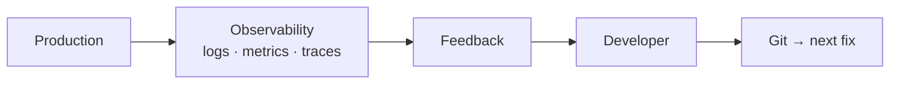

# Observe Recover Secure

> Merged handbook. Sources: 13-observability-and-feedback/observability-feedback.md, 14-reliability-and-recovery/rollback-recovery.md, 11-security/cicd-security.md.


---

<!-- merged-part-1-from: 13-observability-and-feedback/observability-feedback.md -->

<!-- icon: monitoring -->
## Part 1: Observability & Feedback

> Observability (logs, metrics, traces) reveals what a deployment actually did; feedback routes that signal back to the developer so the loop — commit → production → learning — closes.

## 1. What Is It?

Picking up from **[Continuous Delivery](../07-continuous-delivery/continuous-delivery.md)**, where the digest reached production — we now watch what it does there and feed the lessons back.

- **Observability:** logs (events), metrics (numbers over time), traces (request paths) answering "what is production doing?"
- **Feedback:** every signal returned to the author: PR check results, staging smoke verdicts, prod alerts, DORA trends (DORA = DevOps Research & Assessment; its four delivery signals are listed in Section 7).

## 2. Why Does It Exist?

Without feedback, deployment is a cliff — code leaves the pipeline and nobody learns. The loop `deploy → observe → learn → fix` is what makes CI/CD self-improving instead of merely automated.

## 3. Where Does It Fit?



| Signal | Consumer | Action |
|--------|----------|--------|
| PR checks | Developer | Fix before merge |
| Staging smoke | Team | Block promotion |
| Error-rate/latency alert | On-call | Roll back or forward-fix |
| Deploy frequency, MTTR (mean time to recovery) trends | Leads | Improve pipeline |

## 4. How It Works

1. Every deploy is labeled (version/SHA) so logs/metrics correlate with the change.
2. Dashboards track golden signals — the four user-visible health metrics: latency, traffic, errors, saturation — plus business KPIs.
3. Alerts fire on symptom (error budget burn — failures consuming the allowed quota too fast; p99 spike — the slowest 1% of requests degrading), not on every deploy.
4. Incident → revert or forward-fix → postmortem feeds back into pipeline gates (new test, new scan, tighter approval).

## 5. Example

```text
v1.4.2 deploys to production (SHA-labeled)
  → error rate 0.2% → 3.1% in 10 min (alert fires)
  → on-call rolls back to v1.4.1 (4 min, MTTR clock stops)
  → postmortem: missing integration test for null avatar
  → new test added to PR pipeline so the class of bug can't recur
```

## 6. Failure Modes

- Alert fatigue (noisy thresholds) → alerts ignored; fix with SLO-based alerts (SLO = Service Level Objective, e.g. 99.9% successful requests; alert when the error budget burns, not on every blip).
- Unlabeled deploys (can't tell which version broke prod); fix with version annotations everywhere.
- Postmortems without pipeline changes → repeat incidents; every action item should land as a test, check, or runbook.

### SLI / SLO / Alerting

- **SLI** (indicator): what you measure — success ratio, p99 latency. **SLO** (objective): the promise — 99.9% success over 30 days. **Error budget**: 100% − SLO; the failures you're allowed.
- Alert on **budget burn rate**, not raw errors: fast burn (2% budget/hour) pages a human; slow burn (week-long drift) files a ticket. Every alert names its runbook.
- Keep SLOs few (3–5 per service); each SLO without an owner and a consequence is decoration.

## 7. Best Practices

- Standardize structured logs (machine-parseable `key=value` lines, not free text) + trace IDs (one ID following a single request across every service it touches) + version labels from day one.
- Track the four DORA signals: deploy frequency, lead time, change-fail rate, MTTR.
- Make feedback fast: PR results in minutes, prod anomalies in minutes, trends weekly.

### DORA Metrics (What Good Looks Like)

| Signal | Elite hint | Moves it |
|--------|-----------|----------|
| Deploy frequency | On demand, multiple/day | Small batches, trunk discipline, fast PR pipeline |
| Lead time (commit→prod) | < 1 day | Same, plus approval automation |
| Change-fail rate | < 15% | Better PR gates, [canary](../10-deployment-strategies/deployment-strategies.md), flags |
| MTTR | < 1 hour | Version labels, practiced rollback, clear on-call |

Measure monthly, review with leads, improve one signal at a time. DORA classifies; it doesn't fix — the pipeline changes in Section 4 do.

## 8. Interview / Exam Notes

- Logs vs metrics vs traces, one use each.
- Design the rollback decision: which signal, who decides, how fast.
- How a production incident improves the CI pipeline (concrete example above).

The loop is closed conceptually — now see it implemented. Continue in the **[Jenkins Domain](../15-platforms-and-tools/jenkins/README.md)**, where these generic concepts become controllers, agents, and Jenkinsfiles.

## Related Topics

- [CI/CD Overview](../00-foundations/cicd-overview.md)
- [Continuous Delivery](../07-continuous-delivery/continuous-delivery.md)
- [CI/CD Pipelines](../06-ci-cd-pipelines/pipelines.md)


---

<!-- merged-part-2-from: 14-reliability-and-recovery/rollback-recovery.md -->

<!-- icon: monitoring -->
## Part 2: Rollback & Recovery

> Rollback is a feature, not an apology: a practiced, boring path from bad production back to good — decided by signals, executed in minutes, reviewed afterward.

## 1. What Is It?

Picking up from **[CI/CD Security](../11-security/cicd-security.md)**, where defenses were hardened — defenses still fail, so recovery must be engineered with the same rigor as release.

## 2. Rollback per Strategy

| Strategy | Rollback move | Time |
|----------|--------------|------|
| Rolling | Roll back batch by batch (or `rollout undo`) | Minutes |
| Blue/Green | Flip router back to Blue | Seconds |
| Canary | Drain canary, 100% to stable | Seconds–minutes |
| Feature flag | Toggle off | Instant |
| Recreate | Redeploy previous digest | Slowest — avoid where recovery matters |

Rollback deploys a **previous known-good digest** ([Artifact Management](../05-artifacts-and-packaging/artifact-management.md)) — never a fresh build. Fresh builds during incidents add untested variables to a fire.

## 3. Rollback vs Forward-Fix Decision

- **Rollback when:** cause unknown, blast radius growing, error budget burning fast, or the fix is uncertain. Default for Sev1.
- **Forward-fix when:** cause known, fix tiny and verified, rollback itself risky (migrations already applied — data can't "roll back," only migrate forward).
- **Decider:** on-call with pre-agreed thresholds, not a committee. Decide in minutes; review in the postmortem.

## 4. Recovery Drills (MTTR Practice)

- Game days: inject failure in staging (kill pods, expire certs, break the pipeline), time the recovery, fix the gaps found.
- Rollback rehearsal: each service rolls back on staging quarterly until MTTR is measured, not guessed.
- Jenkins/server recovery: restore `JENKINS_HOME` backup to fresh infra, replay smoke pipeline (see [Jenkins Advanced](../15-platforms-and-tools/jenkins/jenkins-advanced.md)).

## 5. Postmortems That Prevent Recurrence

Blameless, owner-assigned, pipeline-linked: every action item becomes a test, check, alert, or runbook — or it will recur. Track repeat-incident rate; a postmortem without a merged pipeline change is a diary entry.

## 6. Data Migration Practice

Data outlives code and can't be discarded on deploy — migrations move forward, never back:

- Version every migration: ordered, reversible scripts run by a migration runner (not hand-applied SQL); each deploy maps to exact schema versions.
- Expand-contract sequencing: add (nullable) → migrate data → enforce; ship app code compatible with both schemas before migrating.
- Risky upgrades: deploy dual-compatible app on the old schema, observe, back up, migrate, then ship schema-dependent code.
- Verify restore, not just backup: rehearse production migration and rollback paths on staging with production-scale data.
- Test data: construct minimal data per test; never depend on full production dumps (slow, privacy-risky, unreproducible).

## 7. Failure Modes

- No practiced rollback → improvisation during incidents; rehearse until boring.
- Rolling forward into a migration → data corruption; expand-contract migrations make both directions safe.
- Rollback untested because "we never need it" → the one time it's needed, it doesn't work. Test the path you pray you never take.

## 8. Interview Notes

- Rollback vs forward-fix: decision criteria in 60 seconds.
- Why rollback uses old digests, never fresh builds.
- Design a game day for a canary-deployed service.
- Rollback vs forward-fix after a migration already applied.

## Related Topics

- [Deployment Strategies](../10-deployment-strategies/deployment-strategies.md)
- [Artifact Management](../05-artifacts-and-packaging/artifact-management.md)
- [Observability & Feedback](../13-observability-and-feedback/observability-feedback.md)
- [Jenkins Advanced](../15-platforms-and-tools/jenkins/jenkins-advanced.md)

Recovery engineered — the library's concept arc is complete. Return to the **[Topic Index](../TOPIC_INDEX.md)** for labs and reference.


---

<!-- merged-part-3-from: 11-security/cicd-security.md -->

<!-- icon: security -->
## Part 3: CI/CD Security

> The pipeline is production infrastructure with production secrets and the power to ship code — attack it like one: least privilege, signed artifacts, verified supply chain.

## 1. What Is It?

Picking up from **[Environments & Release](../09-environments-and-release/environments-release.md)**, whose zones carry real credentials — the pipeline itself is the highest-value target in the estate: it holds deploy keys, signs releases, and runs attacker-influenced PR code.

## 2. Secrets Discipline

- Store in managers (Vault, cloud KMS, Jenkins credentials store, GitHub environments) — never in repos, images, logs, or chat.
- Scope narrowly (per-env, per-job), rotate on schedule and on any leak, audit every access.
- PR builds from forks get zero production secrets — credential-free sandboxes only (see [Jenkins Agents](../15-platforms-and-tools/jenkins/jenkins-agents.md) trust boundary).

## 3. Signing, SBOM & Provenance

Build once, then: sign the digest (cosign), generate the SBOM (Syft/Trivy), attest provenance (SLSA: who built, from which commit, in which pipeline). Deploy policies admit only signed, attested images — see [Artifact Management](../05-artifacts-and-packaging/artifact-management.md). When the next CVE lands, query SBOMs to find affected digests in minutes.

## 4. Least Privilege Everywhere

- CI tokens: per-repo, minimal scopes, short TTL (OIDC federation beats long-lived keys — workloads mint credentials, nobody stores them).
- Pipeline permissions: `GITHUB_TOKEN` minimal scopes; Jenkins agents can't read other jobs' secrets (agent→controller deny).
- Humans: matrix authorization, SSO + MFA, no shared admin accounts, no standing prod access without review.

## 5. Supply-Chain Gates

Pin everything: action SHAs (not `@v4` tags), base image digests (not `:latest`), plugin versions, lockfiles. Verify checksums on download. Each PR that bumps a dependency re-runs the full gate — Dependabot PRs are untrusted code until proven otherwise.

## 6. Governance & Change Evidence

Regulated or not, every team answers "who shipped what, approved by whom, proven how" — the pipeline is the evidence:

- Maturity ladder: manual releases → versioned + automated → gated + attested → measured + continuously improved. Assess per area, fix the most painful gap first.
- Pipeline as audit trail: every production change maps to a commit, a built digest, stage results, approver identity, and target environment — automation beats paper because scripts must actually work to pass.
- Change control that scales: ticketed approvals for production, access-controlled environments, remediation plan + success criteria on every privileged change; low-risk paths auto-approve via policy gates.
- Risk in one line: severity ≈ impact × likelihood; compare against mitigation cost before adding ceremony.
- Value-stream mapping: when delivery feels slow, map commit-to-production steps with wait times — fix the longest wait first, not the loudest complaint.

## 7. Failure Modes

- Secret in git history → rotate immediately; history rewrites don't unsee it (it's cloned everywhere).
- Floating tags (`:latest`, `@v4`) → silent supply-chain swaps; pin digests/SHAs.
- Over-permissioned CI token → one compromised workflow owns the org; scope to the repo, expire fast.
- Unsigned images admitted → provenance theater; enforce admission, don't just generate attestations.

## 8. Interview Notes

- OIDC federation vs long-lived keys for CI auth.
- Design fork-PR isolation for a public repo with deploy secrets.
- SBOM in incident response: CVE lands at 2am, what do you query first?
- Prove a production deploy was authorized: which five pipeline records do you pull?

## Related Topics

- [Artifact Management](../05-artifacts-and-packaging/artifact-management.md)
- [Jenkins Security](../15-platforms-and-tools/jenkins/jenkins-security.md)
- [GitHub Actions](../15-platforms-and-tools/github-actions.md)

Locked down — now plan for when things break anyway. Continue in **[Rollback & Recovery](../14-reliability-and-recovery/rollback-recovery.md)**.
