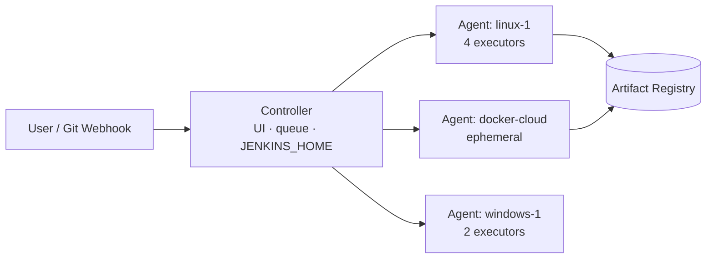
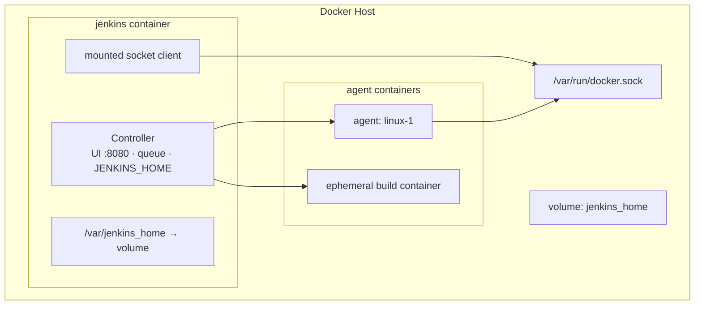

<!-- icon: jenkins -->
# Jenkins Architecture

> Jenkins follows a controller–agent topology: the **controller** schedules work and serves the UI; **agents** (nodes) provide executors that actually run builds.

## 1. What Is It?

Picking up from the **[Jenkins Domain map](README.md)** — we now examine the controller–agent topology that every pipeline, agent, and credential later plugs into.

- **Controller:** holds configuration (`JENKINS_HOME`), the job queue, build history, UI/API, and the credentials store. Runs no (or minimal) builds itself in production.
- **Agent (node):** a machine (VM, container, laptop) connected to the controller offering **executors** — numbered slots, each running one build at a time.
- **Remoting:** the communication channel (inbound TCP/WebSocket or outbound SSH) over which the controller ships work to agents. Inbound = the agent dials out (survives NAT and firewalls); SSH = the controller dials in (simpler on flat networks).

## 2. Diagram

## 3. Key Directories (`JENKINS_HOME`)

| Path | Holds |
|------|-------|
| `jobs/` | Job configs + build history |
| `workspace/` | Checked-out code per job (rebuildable, deletable) |
| `plugins/` | Installed plugins |
| `credentials.xml` / `secrets/` | Encrypted secrets (back up securely!) |
| `config.xml` | Global configuration |

## 4. Sizing Rules

- Controller: CPU-light, I/O-sensitive (build history, XML) — give it fast disk, not 64 cores.
- Zero executors on the controller in production (`# of executors: 0`) so a runaway build can't wedge the UI.
- Scale with agents, preferably ephemeral (Docker/Kubernetes cloud) so capacity matches queue length.

<!-- icon: docker -->
## 5. Jenkins in Docker: How It Works

One `docker run` produces three planes inside a single container:

- **Controller process:** Jenkins WAR runs as PID 1 (Java) inside the container; UI on 8080, agent traffic on 50000 — both published to the host.
- **State:** `JENKINS_HOME` lives on a named volume, not the container layer — recreating the container loses nothing.
- **Building images:** the mounted socket lets the container's Docker CLI ask the *host* daemon to build/run sibling containers. Jenkins never runs a daemon itself (unless DinD sidecar).
- **Agents:** connect over the published 50000/WebSocket back into the controller; Docker-cloud agents are siblings spawned via the same socket.
- **Networking:** agents reach the controller at `host:50000` (or container name on a shared network); webhooks reach `host:8080/github-webhook/`.
## 6. Failure Modes

- Controller disk fills with old builds → UI freezes; fix with build discarders + log rotation.
- All builds pinned to `built-in node` → single point of contention; fix with labeled agents.
- Clock skew between controller and agents → signed artifacts / webhook validation fails; run NTP everywhere.

## 7. Interview Notes

- Controller vs agent responsibilities; why zero executors on controller.
- What `JENKINS_HOME` contains and what must be backed up (jobs, credentials, config — not workspaces).

Topology understood — now build one. Continue in **[Jenkins Setup](jenkins-setup.md)**.

## Related Topics

- [Jenkins Setup](jenkins-setup.md)
- [Jenkins Agents](jenkins-agents.md)
- [CI/CD Pipelines](../../06-ci-cd-pipelines/pipelines.md) (generic concept)
