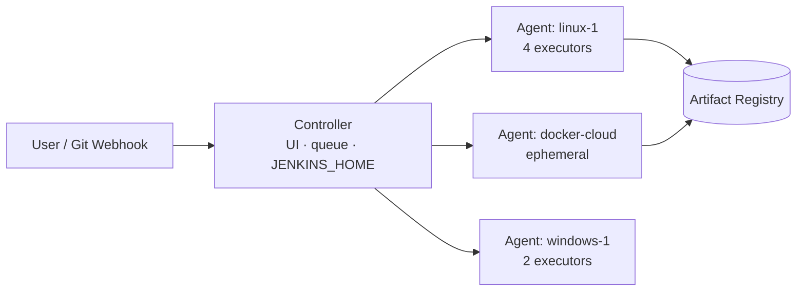
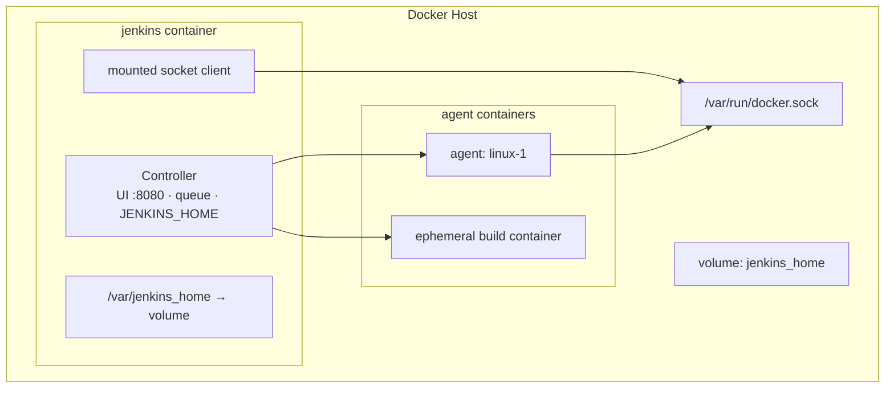
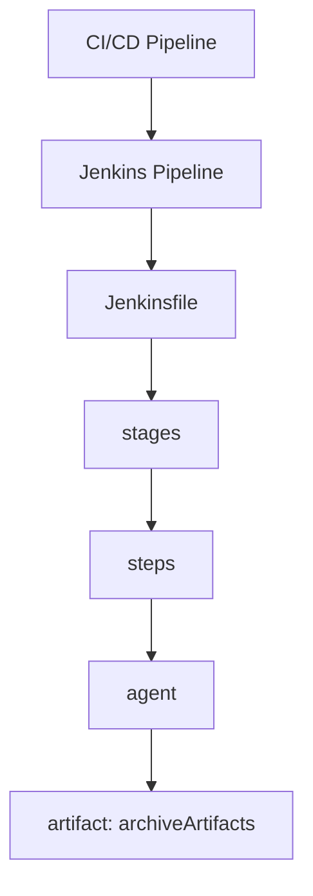

# Jenkins Core Merged

> Merged handbook. Sources: 15-platforms-and-tools/jenkins/README.md, 15-platforms-and-tools/jenkins/jenkins-architecture.md, 15-platforms-and-tools/jenkins/jenkins-setup.md, 15-platforms-and-tools/jenkins/jenkins-pipelines.md, 15-platforms-and-tools/jenkins/jenkins-agents.md.


---

<!-- merged-part-1-from: 15-platforms-and-tools/jenkins/README.md -->

<!-- icon: jenkins -->
## Part 1: Jenkins

> Jenkins is an open-source automation server that *implements* CI/CD concepts: pipelines become Jenkinsfiles, runners become agents, secrets become credentials. Concepts live in [CI/CD Pipelines](../../06-ci-cd-pipelines/pipelines.md); Jenkins specifics live here.

Picking up from **[Observability & Feedback](../../13-observability-and-feedback/observability-feedback.md)**, where the loop closed — we now implement that entire loop in Jenkins, starting with the topology that runs everything.

## Concept → Jenkins Map

| Generic Concept | Jenkins Implementation | Document |
|---|---|---|
| Pipeline | Jenkins Pipeline (Declarative / Scripted) | [jenkins-pipelines.md](jenkins-pipelines.md) |
| Runner / Agent | Jenkins agent (node), executor slots | [jenkins-agents.md](jenkins-agents.md) |
| CI Trigger | Webhook, polling, multibranch scan | [jenkins-webhooks.md](jenkins-webhooks.md) |
| Secrets | Credentials store + bindings | [jenkins-credentials.md](jenkins-credentials.md) |
| Extensibility | Plugins | [jenkins-plugins.md](jenkins-plugins.md) |
| Server topology | Controller + agents | [jenkins-architecture.md](jenkins-architecture.md) |
| Hardening | Auth matrix, agent-to-controller rules | [jenkins-security.md](jenkins-security.md) |
| Installation | WAR / Docker / package | [jenkins-setup.md](jenkins-setup.md) |
| Debugging | Build logs, executor states | [jenkins-troubleshooting.md](jenkins-troubleshooting.md) |

## Why Jenkins?

- **WHAT:** open-source automation server — pipelines as code (Jenkinsfile), 1,800+ plugins, controller + agents topology. Self-hosted, free, runs anywhere.
- **WHY:** vendor-neutral, owns your data/secrets on your infra, reaches exotic targets (mainframes, air-gapped, Windows/GPU builders) SaaS runners can't, and its plugin ecosystem covers nearly every tool.
- **WITHOUT IT (manual CI or scripts on laptops):** no audit trail of who built what, secrets scattered in shell history, "release laptop" as single point of failure, no PR gates, every release depends on one person's memory.

## Reading Order

1. [Architecture](jenkins-architecture.md) → 2. [Setup](jenkins-setup.md) → 3. [Pipelines](jenkins-pipelines.md) → 4. [Groovy Cheatsheet](jenkins-groovy-cheatsheet.md) → 5. [Agents](jenkins-agents.md) → 6. [Credentials](jenkins-credentials.md) → 7. [Plugins](jenkins-plugins.md) → 8. [Webhooks](jenkins-webhooks.md) → 9. [Security](jenkins-security.md) → 10. [Advanced](jenkins-advanced.md) → 11. [Troubleshooting](jenkins-troubleshooting.md)

## The Golden Rule

If a paragraph would be true for GitHub Actions too, it belongs in the generic docs — not here. Jenkins files contain only what is *distinctively Jenkins*.

## Jenkins vs GitHub Actions

Canonical comparison lives in [GitHub Actions](../github-actions.md#9-github-actions-vs-jenkins): Actions trades control for convenience (hosted, YAML, repo-local); Jenkins trades convenience for control (self-hosted, Groovy, controller/agents).

## Interview Notes

- Controller vs agents in one sentence each — where scheduling, secrets, and execution actually live.
- The Golden Rule test: which paragraph in a Jenkins doc proves it belongs in the generic docs instead.
- Jenkins vs GitHub Actions tradeoff in one line — what you gain and what you pay for self-hosting.

Begin the implementation path in **[Jenkins Architecture](jenkins-architecture.md)** — controller, agents, and executors first, because every later doc assumes them.


---

<!-- merged-part-2-from: 15-platforms-and-tools/jenkins/jenkins-architecture.md -->

<!-- icon: jenkins -->
## Part 2: Jenkins Architecture

> Jenkins follows a controller–agent topology: the **controller** schedules work and serves the UI; **agents** (nodes) provide executors that actually run builds.

## 1. What Is It?

Picking up from the **[Jenkins Domain map](README.md)** — we now examine the controller–agent topology that every pipeline, agent, and credential later plugs into.

- **Controller:** holds configuration (`JENKINS_HOME`), the job queue, build history, UI/API, and the credentials store. Runs no (or minimal) builds itself in production.
- **Agent (node):** a machine (VM, container, laptop) connected to the controller offering **executors** — numbered slots, each running one build at a time.
- **Remoting:** the communication channel (inbound TCP/WebSocket or outbound SSH) over which the controller ships work to agents. Inbound = the agent dials out (survives NAT and firewalls); SSH = the controller dials in (simpler on flat networks).

## 2. Diagram



## 3. Key Directories (`JENKINS_HOME`)

| Path | Holds |
|------|-------|
| `jobs/` | Job configs + build history |
| `workspace/` | Checked-out code per job (rebuildable, deletable) |
| `plugins/` | Installed plugins |
| `credentials.xml` / `secrets/` | Encrypted secrets (back up securely!) |
| `config.xml` | Global configuration |

## 4. Sizing Rules

- Controller: CPU-light, I/O-sensitive (build history, XML) — give it fast disk, not 64 cores.
- Zero executors on the controller in production (`# of executors: 0`) so a runaway build can't wedge the UI.
- Scale with agents, preferably ephemeral (Docker/Kubernetes cloud) so capacity matches queue length.

<!-- icon: docker -->
## 5. Jenkins in Docker: How It Works

One `docker run` produces three planes inside a single container:



- **Controller process:** Jenkins WAR runs as PID 1 (Java) inside the container; UI on 8080, agent traffic on 50000 — both published to the host.
- **State:** `JENKINS_HOME` lives on a named volume, not the container layer — recreating the container loses nothing.
- **Building images:** the mounted socket lets the container's Docker CLI ask the *host* daemon to build/run sibling containers. Jenkins never runs a daemon itself (unless DinD sidecar).
- **Agents:** connect over the published 50000/WebSocket back into the controller; Docker-cloud agents are siblings spawned via the same socket.
- **Networking:** agents reach the controller at `host:50000` (or container name on a shared network); webhooks reach `host:8080/github-webhook/`.
## 6. Failure Modes

- Controller disk fills with old builds → UI freezes; fix with build discarders + log rotation.
- All builds pinned to `built-in node` → single point of contention; fix with labeled agents.
- Clock skew between controller and agents → signed artifacts / webhook validation fails; run NTP everywhere.

## 7. Interview Notes

- Controller vs agent responsibilities; why zero executors on controller.
- What `JENKINS_HOME` contains and what must be backed up (jobs, credentials, config — not workspaces).

Topology understood — now build one. Continue in **[Jenkins Setup](jenkins-setup.md)**.

## Related Topics

- [Jenkins Setup](jenkins-setup.md)
- [Jenkins Agents](jenkins-agents.md)
- [CI/CD Pipelines](../../06-ci-cd-pipelines/pipelines.md) (generic concept)


---

<!-- merged-part-3-from: 15-platforms-and-tools/jenkins/jenkins-setup.md -->

<!-- icon: jenkins -->
## Part 3: Jenkins Setup

> Run Jenkins the reproducible way: a pinned Docker image with a persistent volume — never an untracked WAR on someone's laptop.

## 1. Recommended Install (Docker)

Picking up from **[Jenkins Architecture](jenkins-architecture.md)**, where the controller–agent topology was defined — we now run it: one container, one volume, one socket.

```bash
docker volume create jenkins_home
docker run -d --name jenkins \
  -p 8080:8080 -p 50000:50000 \
  -v jenkins_home:/var/jenkins_home \
  jenkins/jenkins:2.516-lts-jdk17
docker logs jenkins 2>&1 | grep -A2 "initialAdminPassword"
docker exec jenkins cat /var/jenkins_home/secrets/initialAdminPassword
```

Open `http://localhost:8080` → paste the admin password → **Install suggested plugins** → create admin user.

## 2. Alternatives

| Method | When |
|--------|------|
| `jenkins/jenkins:lts` Docker image | Default: local dev, training, labs |
| OS package (`apt`/`yum`) | Long-lived on-prem server |
| Kubernetes (Helm chart) | Production with ephemeral agents |
| Bare `jenkins.war` | Only for debugging — hard to reproduce |

## 3. Windows vs WSL2: Where to Run Jenkins

- **Yes, Jenkins runs natively on Windows:** Windows installer (`jenkins.msi`) or `java -jar jenkins.war` with a supported JDK (17 or 21). Works fine as controller or as a Windows build agent (needed for .NET / MSBuild / PowerShell workloads).
- **Prefer Docker Desktop (WSL2 backend) on a Windows dev machine:** same `docker run` command from §1 works in PowerShell or WSL2, keeps paths/line-endings Linux-normal, and matches CI. This is the default recommendation for this KB.
- **Prefer WSL2 Ubuntu when:** pipelines assume `sh`, `make`, `docker`, or Linux-only tooling; you want `apt` packages and case-sensitive paths without Cygwin/Git-Bash quirks.
- **Keep a Windows agent when:** you must build Windows artifacts — run controller in Docker/WSL2, attach a Windows agent via inbound (WebSocket) agent, label it `windows`, and constrain those jobs with `agent { label 'windows' }`.
- **Pitfalls on native Windows:** `bat` vs `sh` steps (use `bat` for `.bat`/PowerShell steps, `sh` only on Linux agents); Git auto-CRLF breaking shell scripts; `C:\` vs `/var/jenkins_home` path mapping into containers; Windows firewall blocking ports 8080/50000.

## 4. First Pipeline Job (Smoke Test)

1. New Item → **Pipeline** → name it `hello`.
2. Definition: *Pipeline script*, enter:

```groovy
pipeline {
    agent any
    stages {
        stage('Hello') {
            steps { echo 'Jenkins is alive' }
        }
    }
}
```

3. Build Now → green ball = controller + executors + workspace all work.

<!-- icon: terminal -->
## 5. Run & Use: Step by Step

### Step 1 — Run the controller

```bash
docker volume create jenkins_home
docker run -d --name jenkins \
  -p 8080:8080 -p 50000:50000 \
  -v jenkins_home:/var/jenkins_home \
  -v /var/run/docker.sock:/var/run/docker.sock \
  jenkins/jenkins:2.516-lts-jdk17
```

### Step 2 — Unlock

```bash
docker exec jenkins cat /var/jenkins_home/secrets/initialAdminPassword
```

Open `http://localhost:8080`, paste the password, click **Install suggested plugins**, create the admin user.

### Step 3 — Lock the controller out of builds

*Manage Jenkins → Nodes → Built-In Node → Configure → # of executors: 0 → Save.* Builds must never run on the controller.

### Step 4 — Connect an agent

*Manage Jenkins → Nodes → New Node* → name `linux-1`, type *Permanent Agent* → labels `linux docker`, executors `2`, launch method per your network (SSH or inbound). Confirm it shows **in sync / idle** under *Build Executor Status*.

### Step 5 — Create the pipeline

New Item → **Multibranch Pipeline** → name `acme-shop` → Branch Source: your repo URL + credentials → Save. Jenkins scans, finds the `Jenkinsfile` (see [jenkins-pipelines.md](jenkins-pipelines.md)), and builds each branch.

### Step 6 — Trigger on push

Repo → *Settings → Webhooks → Add* → Payload URL `http://<jenkins-host>:8080/github-webhook/`, events *push + pull requests* (see [jenkins-webhooks.md](jenkins-webhooks.md)). Push a commit → build starts in seconds.

### Step 7 — Verify the loop

Green build → image in registry → staging deployed → approve → production. Break something on purpose, watch the pipeline go red, read the console log, fix, push green again (see [jenkins-troubleshooting.md](jenkins-troubleshooting.md)).

## 6. Production Hardening Checklist

- [ ] Controller executors = 0; builds run on agents only.
- [ ] `JENKINS_HOME` on persistent, backed-up storage (test restore!).
- [ ] Pin image/plugin versions; upgrade deliberately, never auto-update prod plugins blindly.
- [ ] Reverse proxy (TLS) + authentication matrix from day one (see [jenkins-security.md](jenkins-security.md)).

## 7. Failure Modes

- Data lost on container recreate → volume wasn't mounted; `JENKINS_HOME` must be persistent.
- Stuck on Unlock screen → read the password from `secrets/initialAdminPassword` inside the container, not the host.
- Port 50000 blocked → inbound agents can't connect; open it or use WebSocket agents.

## 8. Interview Notes

- Why zero executors on the controller — what breaks when builds run where scheduling and secrets live.
- What `JENKINS_HOME` must persist across a container recreate, and what is safe to lose (workspaces).
- Webhook vs polling triggers; which port inbound agents need and why WebSocket agents exist.

## Related Topics

- [Jenkins Architecture](jenkins-architecture.md)
- [Jenkins Pipelines](jenkins-pipelines.md)

Server running and first job green — now write real pipelines. Continue in **[Jenkins Pipelines](jenkins-pipelines.md)**.


---

<!-- merged-part-4-from: 15-platforms-and-tools/jenkins/jenkins-pipelines.md -->

<!-- icon: jenkins -->
## Part 4: Jenkins Pipelines

> A Jenkins Pipeline is the generic pipeline concept expressed as code: a **Jenkinsfile** (Declarative or Scripted) where `stages` contain `steps` and `agent` decides where they run.

Picking up from **[Jenkins Setup](jenkins-setup.md)**, where the first smoke job went green — we now write production Jenkinsfiles: Declarative structure, multibranch, and the full CI→CD arc.

## 1. Concept → Jenkins Mapping



| Generic | Jenkins |
|---------|---------|
| Pipeline | `pipeline { ... }` in Jenkinsfile |
| Stage | `stage('Build') { ... }` |
| Job | A Jenkins *item* (Pipeline job / Multibranch) wrapping the Jenkinsfile run |
| Step | `sh`, `echo`, `git`, plugin steps |
| Runner | `agent` directive (label, docker, any, none) |
| Artifact | `archiveArtifacts` / pushed image |

## 2. Declarative vs Scripted

| | Declarative (default) | Scripted |
|---|---|---|
| Syntax | Opinionated `pipeline { agent stages steps post }` | Full Groovy `node { stage(...) { ... } }` |
| Validation | Syntax-checked pre-run | Fails at runtime |
| Use when | 95% of pipelines | Dynamic stage generation, advanced control flow |

### The Language: Groovy

- **Base language:** Apache Groovy (JVM, Java-like syntax) — Jenkins pipelines are Groovy scripts executed by the controller.
- **Declarative** restricts Groovy to the `pipeline { agent stages steps post }` skeleton; most logic lives in `sh` steps, keeping Groovy surface tiny.
- **Scripted** is raw Groovy: loops, functions, try/catch, dynamic stage generation via `node { stage(...) { ... } }`.
- **Pipeline DSL steps** (`sh`, `echo`, `git`, `junit`, `withCredentials`, plugin steps) are Jenkins-provided Groovy methods, documented in the built-in *Pipeline Syntax* snippet generator (`<jenkins>/pipeline-syntax`).
- **Sandbox:** repo-committed scripts run in the Groovy sandbox — only allowlisted methods execute; anything else needs *In-process Script Approval* (see [troubleshooting](jenkins-troubleshooting.md)).

## 3. Canonical Jenkinsfile

```groovy
pipeline {
    agent { label 'linux' }          // where: Jenkins agent with this label
    options { timeout(time: 20, unit: 'MINUTES') }
    environment { APP = 'acme-shop' }

    stages {
        stage('Build') {
            steps { sh 'npm ci && npm run build' }
        }
        stage('Test') {
            steps { sh 'npm test' }
            post { always { junit 'reports/**/*.xml' } }
        }
        stage('Image') {
            steps {
                sh 'docker build -t registry/acme-shop:$GIT_COMMIT .'
                sh 'docker push registry/acme-shop:$GIT_COMMIT'
            }
        }
    }
    post {
        success { echo 'Green — promotable' }
        failure { mail to: 'team@acme.io', subject: "FAILED: ${env.JOB_NAME}" }
    }
}
```

## 4. Multibranch Pipelines

A **Multibranch Pipeline** job auto-discovers branches/PRs containing a Jenkinsfile and builds each independently — this is the Jenkins-native PR gate (pairs with [webhooks](jenkins-webhooks.md)). Prefer it over one hand-wired job per branch.

## 5. Failure Modes

- `agent any` everywhere → builds land on controller; always use labeled agents.
- Script not in SCM (inline script job) → unreviewable, unaudited; keep Jenkinsfiles in the repo.
- Giant single stage → no visibility, no parallelism; mirror generic stages (build/test/scan) 1:1.

<!-- icon: docker -->
## 6. CI/CD with Jenkins in Docker

The catch: a containerized Jenkins can't `docker build` without access to a Docker daemon. Give it the host's:

```bash
docker run -d --name jenkins \
  -p 8080:8080 -p 50000:50000 \
  -v jenkins_home:/var/jenkins_home \
  -v /var/run/docker.sock:/var/run/docker.sock \
  jenkins/jenkins:2.516-lts-jdk17
```

(Alternative: Docker-in-Docker sidecar — heavier, preferred only when the host socket is off-limits for security.)

Then the Jenkinsfile does the full CI→CD arc — build, test, push the image, deploy the same digest:

```groovy
pipeline {
    agent any
    environment { IMG = "registry/acme-shop:${env.GIT_COMMIT}" }
    stages {
        stage('Build & Test') {
            steps { sh 'npm ci && npm run build && npm test' }
        }
        stage('Image') {
            steps {
                sh 'docker build -t $IMG .'
                sh 'echo "$REG_PWD" | docker login registry -u "$REG_USER" --password-stdin'
                sh 'docker push $IMG'
            }
        }
        stage('Deploy: Staging') {
            steps { sh './deploy.sh staging $IMG' }   // same digest, auto
        }
        stage('Deploy: Production') {
            input { message 'Promote $IMG to production?' }  // approval gate
            steps { sh './deploy.sh production $IMG' }
        }
    }
}
```

- `input` = the Delivery approval gate: pipeline pauses until a human clicks Proceed.
- Staging deploys automatically; production waits — Continuous Delivery out of the box. Remove `input` and it's Continuous Deployment.

### Docker-in-Docker (DinD) vs Socket Mount

| | Socket mount (`-v /var/run/docker.sock`) | Docker-in-Docker |
|---|---|---|
| Daemon | Host's daemon; containers are siblings | Separate daemon inside a privileged `docker:dind` container |
| Setup | One `-v` flag | Privileged container + TLS certs + `DOCKER_HOST=tcp://docker:2376` |
| Isolation | Weak — builds share the host daemon, see each other's containers/images | Strong — each stack gets its own daemon |
| Risk | A malicious build controls the host daemon (= host root) | Privileged mode still risky, but blast radius is the dind container |
| Speed | Fast (host cache shared) | Slower cold cache per daemon |

```bash
## Part 4: DinD stack: daemon + Jenkins on a shared network
docker network create ci
docker run -d --name dind --network ci --privileged \
  -v dind-certs:/certs -e DOCKER_TLS_CERTDIR=/certs \
  docker:27-dind
docker run -d --name jenkins --network ci \
  -p 8080:8080 -p 50000:50000 \
  -v jenkins_home:/var/jenkins_home \
  -v dind-certs:/certs:ro \
  -e DOCKER_HOST=tcp://dind:2376 \
  -e DOCKER_TLS_VERIFY=1 -e DOCKER_CERT_PATH=/certs/client \
  jenkins/jenkins:2.516-lts-jdk17
```

Rule: socket mount for trusted internal teams (simple, fast); DinD for untrusted builds where daemon isolation matters. Either way the Jenkinsfile stays identical — only `DOCKER_HOST` changes.

### End-to-End: Jenkins → Docker Hub

Prerequisites: agent with Docker daemon access (above), Docker Pipeline + Git plugins installed, Jenkins user in the `docker` group, a Docker Hub account with a target repository.

**1. Store the Docker Hub token.** The controller holds the secret, the agent only receives it masked at runtime (see [Credentials](jenkins-credentials.md)). Generate a token in Docker Hub (*Account Settings → Security → New Access Token*), then save it in Jenkins (*Manage Jenkins → Credentials → Global → Add Credentials*) as Kind *Username with password*: username = Docker Hub username, password = token, ID = `dockerhub-credentials`.

**2. Jenkinsfile at the repo root** (next to `Dockerfile`):

```groovy
pipeline {
    agent { label 'linux' }   // agent with Docker daemon access, never the controller
    environment {
        DOCKER_IMAGE = 'yourusername/myapp'   // your Docker Hub repo
        IMAGE_TAG    = "build-${env.BUILD_NUMBER}"
    }
    stages {
        stage('Checkout') {
            steps { checkout scm }   // agent pulls the code the Jenkinsfile lives with
        }
        stage('Build') {
            steps { sh 'docker build -t $DOCKER_IMAGE:$IMAGE_TAG .' }
        }
        stage('Login & Push') {
            steps {
                withCredentials([usernamePassword(
                    credentialsId: 'dockerhub-credentials',
                    usernameVariable: 'U', passwordVariable: 'P')]) {
                    sh 'echo "$P" | docker login -u "$U" --password-stdin'  // stdin keeps the token out of the process list and logs
                    sh 'docker push $DOCKER_IMAGE:$IMAGE_TAG'
                    sh 'docker tag $DOCKER_IMAGE:$IMAGE_TAG $DOCKER_IMAGE:latest && docker push $DOCKER_IMAGE:latest'
                }
            }
        }
    }
    post {
        always {
            sh 'docker rmi $DOCKER_IMAGE:$IMAGE_TAG || true'  // agent frees disk so repeated builds do not fill it
            sh 'docker logout || true'
        }
    }
}
```

**3. Wire the job.** *New Item → Pipeline → OK → Pipeline → Definition: Pipeline script from SCM → SCM: Git → Repository URL → Script Path: `Jenkinsfile` → Save → Build Now.* Prefer a Multibranch job (§4) when every branch should build independently.

**4. Verify.** On hub.docker.com → *Repositories* → target repo → *Tags*: `build-N` and `latest` appear with fresh timestamps. That image digest is what the staging/production stages above deploy.

Failure modes: `permission denied` on `docker build` → agent user not in `docker` group; `denied: requested access` on push → wrong Hub repo name or token without write scope; stale `latest` after a fix → the versioned tag moved but the `latest` re-tag/push step was skipped — always push both.

### Variant: Python app + versioned tag + simulator deploy

The same shape covers a Python service deployed to a simulated AWS environment (Floci — an AWS API simulator used for pipeline practice without real cloud cost). The repo root holds four files: `hello.py`, `requirements.txt`, `Dockerfile`, `Jenkinsfile`.

```dockerfile
FROM python:3.12-slim
WORKDIR /app
COPY requirements.txt .
RUN pip install --no-cache-dir -r requirements.txt
COPY hello.py .
CMD ["python", "hello.py"]
```

Two differences from the Jenkinsfile above: the credential ID is whatever string was chosen at creation (`docker-hub-creds` below — any ID works as long as the Jenkinsfile references the same string), and the tag uses Jenkins' build counter (`v${BUILD_NUMBER}`, e.g. `v14`, `v15`) so every artifact is uniquely traceable:

```groovy
environment {
    DOCKER_CREDS_ID = 'docker-hub-creds'   // must match Manage Jenkins → Credentials → ID
    DOCKER_IMAGE    = 'yourusername/hello-app'
    IMAGE_TAG       = "v${env.BUILD_NUMBER}"
    FLOCI_ENDPOINT  = 'http://floci-simulator-api:4566'
}
// ...
        stage('Deploy to Floci') {
            steps {
                sh '''
                    curl -X POST $FLOCI_ENDPOINT/deploy \
                      -H "Content-Type: application/json" \
                      -d "{\"image\": \"$DOCKER_IMAGE:$IMAGE_TAG\", \"service\": \"hello-app\"}"
                '''
            }
        }
```

The deploy stage is the generic "pipeline calls the environment's API with the new image coordinates" pattern — Floci's `/deploy` endpoint stands in for an ECS `UpdateService`, a Kubernetes rollout, or any deploy API. The agent pushes; the target environment pulls `$DOCKER_IMAGE:$IMAGE_TAG` from Docker Hub. Failure modes: endpoint unreachable → the agent cannot resolve the simulator hostname (it must share the simulator's network/DNS); environment runs stale code → the deploy stage sent the versioned tag but the environment defaults to `:latest`, or vice versa — send and pull the identical tag.

## 7. Interview Notes

- Declarative vs Scripted, with a reason to choose each.
- What `agent`, `post`, `options`, `environment` do.
- Why Jenkinsfile belongs in source control next to the code it builds.

## Kaniko on Kubernetes Agents

Daemon-free image builds from locked-down agents (see [CI/CD Pipelines](../../06-ci-cd-pipelines/pipelines.md) for the generic Kaniko pattern):

```groovy
// Jenkins Kubernetes agent: kaniko executor builds + pushes, no daemon at all
container('kaniko') {
    sh '/kaniko/executor --context `pwd` --destination registry/app:$GIT_COMMIT'
}
```

## Related Topics

- [CI/CD Pipelines](../../06-ci-cd-pipelines/pipelines.md) (generic — read first)
- [Jenkins Agents](jenkins-agents.md)
- [Jenkins Webhooks](jenkins-webhooks.md)

Pipelines need a language upgrade next: the Groovy subset that powers them lives in the **[Groovy Cheatsheet](jenkins-groovy-cheatsheet.md)** — read it before your first Scripted block.


---

<!-- merged-part-5-from: 15-platforms-and-tools/jenkins/jenkins-agents.md -->

<!-- icon: server -->
## Part 5: Jenkins Agents

> Agents are Jenkins's word for runners: machines offering **executors** to the controller, selected by **labels**. Prefer ephemeral agents that live only for one build.

## 1. Types

Picking up from the **[Groovy Cheatsheet](jenkins-groovy-cheatsheet.md)** — pipelines written, language in hand — we now provision the machines that execute them: agents, labels, executors.

| Type | Lifecycle | Best for |
|------|-----------|----------|
| Permanent (SSH/inbound) | Long-lived VM | Special hardware, Windows/GPU builders |
| Docker cloud | Container per build, destroyed after | Default Linux builds — clean env every time |
| Kubernetes cloud | Pod per build | Elastic, bursty CI on existing clusters |

## 2. Labels & Executors

```groovy
agent { label 'linux && docker' }   // must have BOTH labels
agent { docker { image 'node:20' } } // ephemeral container on any Docker agent
agent none                           // top-level: each stage picks its own agent
```

- **Label:** capability tag (`linux`, `windows`, `gpu`, `docker`) matched by `agent { label ... }`.
- **Executor:** one build slot; a 4-core agent typically offers 2–4 executors.

## 3. Minimal Docker-Agent Pipeline

```groovy
pipeline {
    agent { docker { image 'maven:3.9-eclipse-temurin-17' } }
    stages {
        stage('Build') { steps { sh 'mvn -B package' } }
    }
}
```

Each run gets a pristine container — "works on my machine" dies here.

## 4. Connection Methods

- **Inbound (agent → controller):** agent initiates via WebSocket/JNLP; survives NAT, needs port 50000 or WebSocket endpoint.
- **SSH (controller → agent):** controller SSHes in; simple on flat networks, needs credential + open port 22.

## 5. Failure Modes

- Label typo (`lable 'linx'`) → build waits forever in queue; check *Build Executor Status*.
- Stale permanent agents (tool drift) → flaky builds; prefer ephemeral or reimage regularly.
- Too many executors per CPU → builds starve each other; ~1 executor per 1–2 cores.

## 6. Interview Notes

- Inbound vs SSH connection: which side initiates, and which survives NAT without opening inbound ports.
- Why ephemeral agents beat permanent ones for reproducibility — what "tool drift" does to flaky-build rates.
- Label expressions vs executor counts: what a build stuck in queue almost always means.

Agents run the work — next they need secrets. Continue in **[Jenkins Credentials](jenkins-credentials.md)**.

## Related Topics

- [Jenkins Architecture](jenkins-architecture.md)
- [Jenkins Pipelines](jenkins-pipelines.md)
