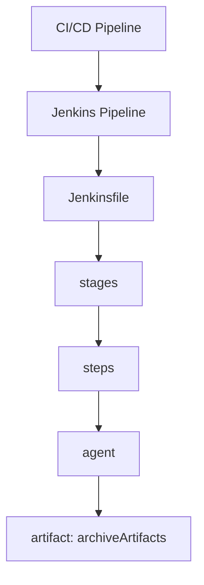

<!-- icon: jenkins -->
# Jenkins Pipelines

> A Jenkins Pipeline is the generic pipeline concept expressed as code: a **Jenkinsfile** (Declarative or Scripted) where `stages` contain `steps` and `agent` decides where they run.

Picking up from **[Jenkins Setup](jenkins-setup.md)**, where the first smoke job went green — we now write production Jenkinsfiles: Declarative structure, multibranch, and the full CI→CD arc.

## 1. Concept → Jenkins Mapping



| Generic | Jenkins |
|---------|---------|
| Pipeline | `pipeline { ... }` in Jenkinsfile |
| Stage | `stage('Build') { ... }` |
| Job | A Jenkins *item* (Pipeline job / Multibranch) wrapping the Jenkinsfile run |
| Step | `sh`, `echo`, `git`, plugin steps |
| Runner | `agent` directive (label, docker, any, none) |
| Artifact | `archiveArtifacts` / pushed image |

## 2. Declarative vs Scripted

| | Declarative (default) | Scripted |
|---|---|---|
| Syntax | Opinionated `pipeline { agent stages steps post }` | Full Groovy `node { stage(...) { ... } }` |
| Validation | Syntax-checked pre-run | Fails at runtime |
| Use when | 95% of pipelines | Dynamic stage generation, advanced control flow |

### The Language: Groovy

- **Base language:** Apache Groovy (JVM, Java-like syntax) — Jenkins pipelines are Groovy scripts executed by the controller.
- **Declarative** restricts Groovy to the `pipeline { agent stages steps post }` skeleton; most logic lives in `sh` steps, keeping Groovy surface tiny.
- **Scripted** is raw Groovy: loops, functions, try/catch, dynamic stage generation via `node { stage(...) { ... } }`.
- **Pipeline DSL steps** (`sh`, `echo`, `git`, `junit`, `withCredentials`, plugin steps) are Jenkins-provided Groovy methods, documented in the built-in *Pipeline Syntax* snippet generator (`<jenkins>/pipeline-syntax`).
- **Sandbox:** repo-committed scripts run in the Groovy sandbox — only allowlisted methods execute; anything else needs *In-process Script Approval* (see [troubleshooting](jenkins-troubleshooting.md)).

## 3. Canonical Jenkinsfile

```groovy
pipeline {
    agent { label 'linux' }          // where: Jenkins agent with this label
    options { timeout(time: 20, unit: 'MINUTES') }
    environment { APP = 'acme-shop' }

    stages {
        stage('Build') {
            steps { sh 'npm ci && npm run build' }
        }
        stage('Test') {
            steps { sh 'npm test' }
            post { always { junit 'reports/**/*.xml' } }
        }
        stage('Image') {
            steps {
                sh 'docker build -t registry/acme-shop:$GIT_COMMIT .'
                sh 'docker push registry/acme-shop:$GIT_COMMIT'
            }
        }
    }
    post {
        success { echo 'Green — promotable' }
        failure { mail to: 'team@acme.io', subject: "FAILED: ${env.JOB_NAME}" }
    }
}
```

## 4. Multibranch Pipelines

A **Multibranch Pipeline** job auto-discovers branches/PRs containing a Jenkinsfile and builds each independently — this is the Jenkins-native PR gate (pairs with [webhooks](jenkins-webhooks.md)). Prefer it over one hand-wired job per branch.

## 5. Failure Modes

- `agent any` everywhere → builds land on controller; always use labeled agents.
- Script not in SCM (inline script job) → unreviewable, unaudited; keep Jenkinsfiles in the repo.
- Giant single stage → no visibility, no parallelism; mirror generic stages (build/test/scan) 1:1.

<!-- icon: docker -->
## 6. CI/CD with Jenkins in Docker

The catch: a containerized Jenkins can't `docker build` without access to a Docker daemon. Give it the host's:

```bash
docker run -d --name jenkins \
  -p 8080:8080 -p 50000:50000 \
  -v jenkins_home:/var/jenkins_home \
  -v /var/run/docker.sock:/var/run/docker.sock \
  jenkins/jenkins:2.516-lts-jdk17
```

(Alternative: Docker-in-Docker sidecar — heavier, preferred only when the host socket is off-limits for security.)

Then the Jenkinsfile does the full CI→CD arc — build, test, push the image, deploy the same digest:

```groovy
pipeline {
    agent any
    environment { IMG = "registry/acme-shop:${env.GIT_COMMIT}" }
    stages {
        stage('Build & Test') {
            steps { sh 'npm ci && npm run build && npm test' }
        }
        stage('Image') {
            steps {
                sh 'docker build -t $IMG .'
                sh 'echo "$REG_PWD" | docker login registry -u "$REG_USER" --password-stdin'
                sh 'docker push $IMG'
            }
        }
        stage('Deploy: Staging') {
            steps { sh './deploy.sh staging $IMG' }   // same digest, auto
        }
        stage('Deploy: Production') {
            input { message 'Promote $IMG to production?' }  // approval gate
            steps { sh './deploy.sh production $IMG' }
        }
    }
}
```

- `input` = the Delivery approval gate: pipeline pauses until a human clicks Proceed.
- Staging deploys automatically; production waits — Continuous Delivery out of the box. Remove `input` and it's Continuous Deployment.

### Docker-in-Docker (DinD) vs Socket Mount

| | Socket mount (`-v /var/run/docker.sock`) | Docker-in-Docker |
|---|---|---|
| Daemon | Host's daemon; containers are siblings | Separate daemon inside a privileged `docker:dind` container |
| Setup | One `-v` flag | Privileged container + TLS certs + `DOCKER_HOST=tcp://docker:2376` |
| Isolation | Weak — builds share the host daemon, see each other's containers/images | Strong — each stack gets its own daemon |
| Risk | A malicious build controls the host daemon (= host root) | Privileged mode still risky, but blast radius is the dind container |
| Speed | Fast (host cache shared) | Slower cold cache per daemon |

```bash
# DinD stack: daemon + Jenkins on a shared network
docker network create ci
docker run -d --name dind --network ci --privileged \
  -v dind-certs:/certs -e DOCKER_TLS_CERTDIR=/certs \
  docker:27-dind
docker run -d --name jenkins --network ci \
  -p 8080:8080 -p 50000:50000 \
  -v jenkins_home:/var/jenkins_home \
  -v dind-certs:/certs:ro \
  -e DOCKER_HOST=tcp://dind:2376 \
  -e DOCKER_TLS_VERIFY=1 -e DOCKER_CERT_PATH=/certs/client \
  jenkins/jenkins:2.516-lts-jdk17
```

Rule: socket mount for trusted internal teams (simple, fast); DinD for untrusted builds where daemon isolation matters. Either way the Jenkinsfile stays identical — only `DOCKER_HOST` changes.

### End-to-End: Jenkins → Docker Hub

Prerequisites: agent with Docker daemon access (above), Docker Pipeline + Git plugins installed, Jenkins user in the `docker` group, a Docker Hub account with a target repository.

**1. Store the Docker Hub token.** The controller holds the secret, the agent only receives it masked at runtime (see [Credentials](jenkins-credentials.md)). Generate a token in Docker Hub (*Account Settings → Security → New Access Token*), then save it in Jenkins (*Manage Jenkins → Credentials → Global → Add Credentials*) as Kind *Username with password*: username = Docker Hub username, password = token, ID = `dockerhub-credentials`.

**2. Jenkinsfile at the repo root** (next to `Dockerfile`):

```groovy
pipeline {
    agent { label 'linux' }   // agent with Docker daemon access, never the controller
    environment {
        DOCKER_IMAGE = 'yourusername/myapp'   // your Docker Hub repo
        IMAGE_TAG    = "build-${env.BUILD_NUMBER}"
    }
    stages {
        stage('Checkout') {
            steps { checkout scm }   // agent pulls the code the Jenkinsfile lives with
        }
        stage('Build') {
            steps { sh 'docker build -t $DOCKER_IMAGE:$IMAGE_TAG .' }
        }
        stage('Login & Push') {
            steps {
                withCredentials([usernamePassword(
                    credentialsId: 'dockerhub-credentials',
                    usernameVariable: 'U', passwordVariable: 'P')]) {
                    sh 'echo "$P" | docker login -u "$U" --password-stdin'  // stdin keeps the token out of the process list and logs
                    sh 'docker push $DOCKER_IMAGE:$IMAGE_TAG'
                    sh 'docker tag $DOCKER_IMAGE:$IMAGE_TAG $DOCKER_IMAGE:latest && docker push $DOCKER_IMAGE:latest'
                }
            }
        }
    }
    post {
        always {
            sh 'docker rmi $DOCKER_IMAGE:$IMAGE_TAG || true'  // agent frees disk so repeated builds do not fill it
            sh 'docker logout || true'
        }
    }
}
```

**3. Wire the job.** *New Item → Pipeline → OK → Pipeline → Definition: Pipeline script from SCM → SCM: Git → Repository URL → Script Path: `Jenkinsfile` → Save → Build Now.* Prefer a Multibranch job (§4) when every branch should build independently.

**4. Verify.** On hub.docker.com → *Repositories* → target repo → *Tags*: `build-N` and `latest` appear with fresh timestamps. That image digest is what the staging/production stages above deploy.

Failure modes: `permission denied` on `docker build` → agent user not in `docker` group; `denied: requested access` on push → wrong Hub repo name or token without write scope; stale `latest` after a fix → the versioned tag moved but the `latest` re-tag/push step was skipped — always push both.

### Variant: Python app + versioned tag + simulator deploy

The same shape covers a Python service deployed to a simulated AWS environment (Floci — an AWS API simulator used for pipeline practice without real cloud cost). The repo root holds four files: `hello.py`, `requirements.txt`, `Dockerfile`, `Jenkinsfile`.

```dockerfile
FROM python:3.12-slim
WORKDIR /app
COPY requirements.txt .
RUN pip install --no-cache-dir -r requirements.txt
COPY hello.py .
CMD ["python", "hello.py"]
```

Two differences from the Jenkinsfile above: the credential ID is whatever string was chosen at creation (`docker-hub-creds` below — any ID works as long as the Jenkinsfile references the same string), and the tag uses Jenkins' build counter (`v${BUILD_NUMBER}`, e.g. `v14`, `v15`) so every artifact is uniquely traceable:

```groovy
environment {
    DOCKER_CREDS_ID = 'docker-hub-creds'   // must match Manage Jenkins → Credentials → ID
    DOCKER_IMAGE    = 'yourusername/hello-app'
    IMAGE_TAG       = "v${env.BUILD_NUMBER}"
    FLOCI_ENDPOINT  = 'http://floci-simulator-api:4566'
}
// ...
        stage('Deploy to Floci') {
            steps {
                sh '''
                    curl -X POST $FLOCI_ENDPOINT/deploy \
                      -H "Content-Type: application/json" \
                      -d "{\"image\": \"$DOCKER_IMAGE:$IMAGE_TAG\", \"service\": \"hello-app\"}"
                '''
            }
        }
```

The deploy stage is the generic "pipeline calls the environment's API with the new image coordinates" pattern — Floci's `/deploy` endpoint stands in for an ECS `UpdateService`, a Kubernetes rollout, or any deploy API. The agent pushes; the target environment pulls `$DOCKER_IMAGE:$IMAGE_TAG` from Docker Hub. Failure modes: endpoint unreachable → the agent cannot resolve the simulator hostname (it must share the simulator's network/DNS); environment runs stale code → the deploy stage sent the versioned tag but the environment defaults to `:latest`, or vice versa — send and pull the identical tag.

## 7. Interview Notes

- Declarative vs Scripted, with a reason to choose each.
- What `agent`, `post`, `options`, `environment` do.
- Why Jenkinsfile belongs in source control next to the code it builds.

## Related Topics

- [CI/CD Pipelines](../../06-ci-cd-pipelines/pipelines.md) (generic — read first)
- [Jenkins Agents](jenkins-agents.md)
- [Jenkins Webhooks](jenkins-webhooks.md)

Pipelines need a language upgrade next: the Groovy subset that powers them lives in the **[Groovy Cheatsheet](jenkins-groovy-cheatsheet.md)** — read it before your first Scripted block.
