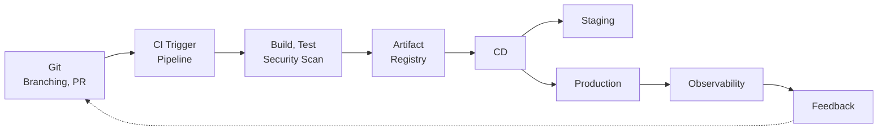

# CI/CD Knowledge Base

> Canonical source for CI/CD learning material. Every PDF, website page, lab, and exam note derives from this Markdown.

## Learning Flow

## Map

| # | Area | Document |
|---|------|----------|
| 00 | Foundations | [CI/CD Overview](00-foundations/cicd-overview.md) |
| 01 | Source Control | [Git, Branching & Pull Requests](01-source-control/git-branching-pull-requests.md) |
| 06 | Pipelines | [CI/CD Pipelines](06-ci-cd-pipelines/pipelines.md) |
| 05 | Artifacts | [Artifact Management](05-artifacts-and-packaging/artifact-management.md) |
| 07 | Delivery | [Continuous Delivery](07-continuous-delivery/continuous-delivery.md) |
| 13 | Feedback | [Observability & Feedback](13-observability-and-feedback/observability-feedback.md) |
| 15 | Platforms | [Jenkins Domain](15-platforms-and-tools/jenkins/README.md) |

## Rules

- Source of truth: Markdown first, PDF/website second.
- See [DOCUMENTATION_RULES.md](DOCUMENTATION_RULES.md) before adding content.
- Track coverage in [TOPIC_INDEX.md](TOPIC_INDEX.md) and [ROADMAP.md](ROADMAP.md).
- Terms defined in [GLOSSARY.md](GLOSSARY.md).
